# Day 10 — The Hollow Shell

## Summary

You find it on the beach: pretty, ordinary, the kind of thing nobody thinks to check. Slip something inside and hold it to your ear.

## Objective

The Byte Lotus beachfront lets guests personalise their in-room display by uploading a shell — a little souvenir pack of shoreline ambiance. Staff publish them through the Shoreline Display portal, and once a shell is "held to the room's ear" it plays its shore. Slip past what the portal forgets to check, and the shell answers with a shell of your own.

## Tools / Techniques / Threat Vectors

- Nmap (service/version scanning)
- Gobuster (directory enumeration)
- Burp Suite (request inspection)
- Python `zipfile` module (crafting a malicious archive)
- Zip Slip (path traversal via archive extraction)
- Arbitrary file write leading to remote code execution
- Penelope (reverse shell handling)

---

## Steps Taken

1. Kicked things off with an Nmap service/version scan against the target IP. It came back with two open ports: `22/tcp` (SSH) and `5000/tcp`, the latter running Gunicorn with an HTTP title of "Byte Lotus — Room Service" and a requested resource of `/login`.

   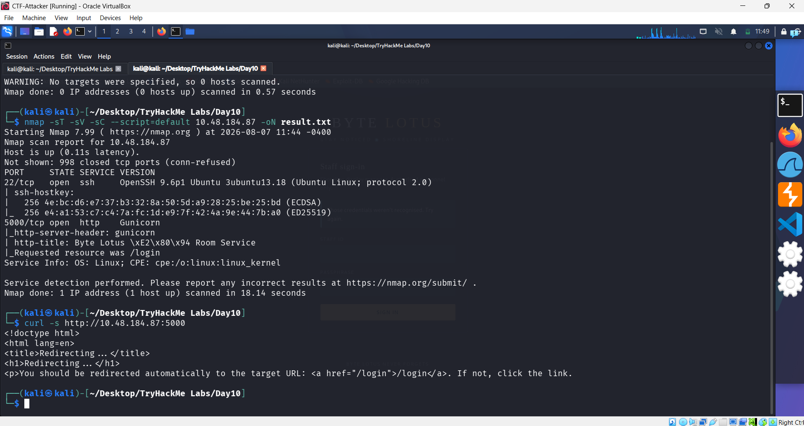

2. The room's instructions pointed to `http://<ip-address>` with no port specified, which meant it was quietly defaulting to port 80 — and that goes nowhere here. Appending `:5000` to the URL got me into the actual web application.

   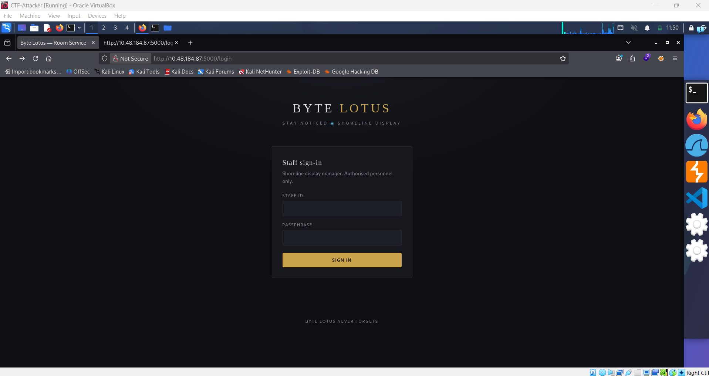

3. Took a look at the login portal's page source and found something staff clearly forgot was still sitting there: hardcoded default credentials left in an HTML comment, `concierge` / `StayNoticed2024!`, described as a "starter login" for new hires.

   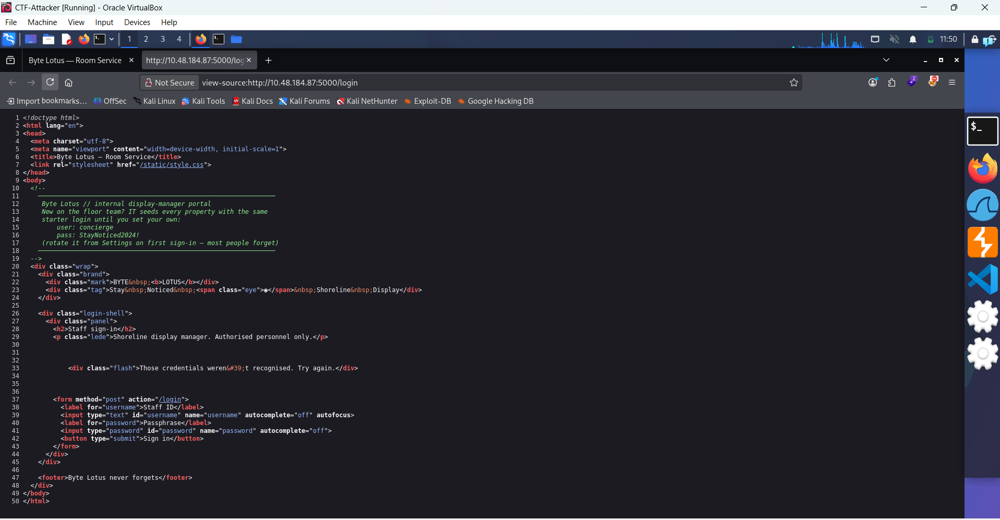

4. Logged in with those leaked credentials and landed on the "Shoreline Display" dashboard. From here, staff can upload a `.zip` "shell" — a little souvenir pack — containing a `shell.json` manifest plus optional assets like png, jpg, gif, svg, css, and json.

   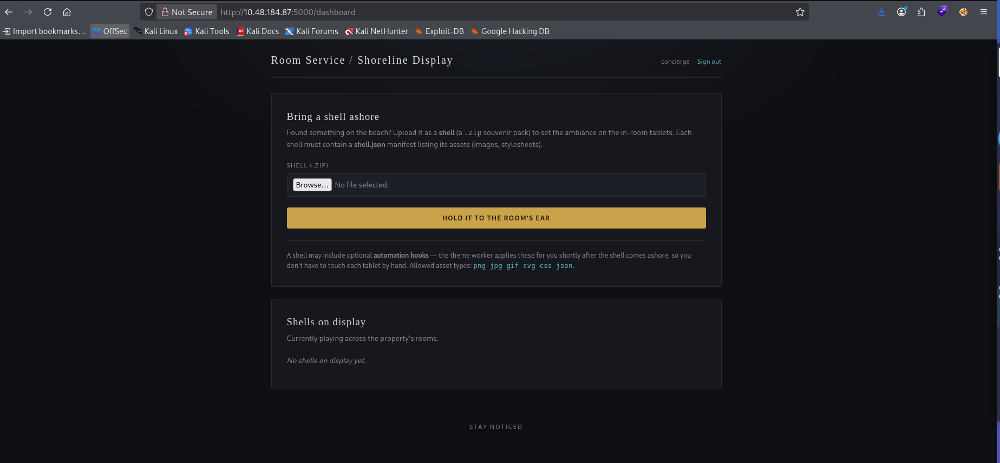

5. First tried uploading a zip with no `shell.json` inside, just to see how the app would react. It pushed back immediately:

    ```text
    Shell is missing shell.json.
    ```

   So the fix was straightforward — create a `shell.json` and zip it up properly using the `zip` utility on my machine, like in the image below.

   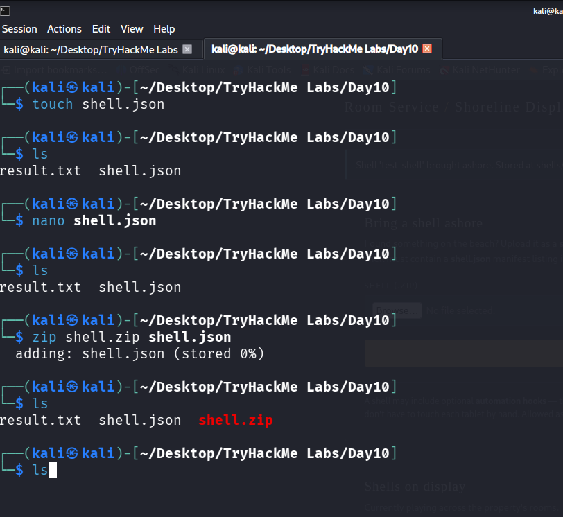

6. One thing to watch for when zipping: `shell.json` needs to sit at the root of the archive, meaning you zip *from inside* the folder containing it (your `pwd`), not the folder itself. Once I fixed that, the upload went through, and the response confirmed the shell was "brought ashore" and stored server-side at a path following the pattern `shells/<id>/`.

   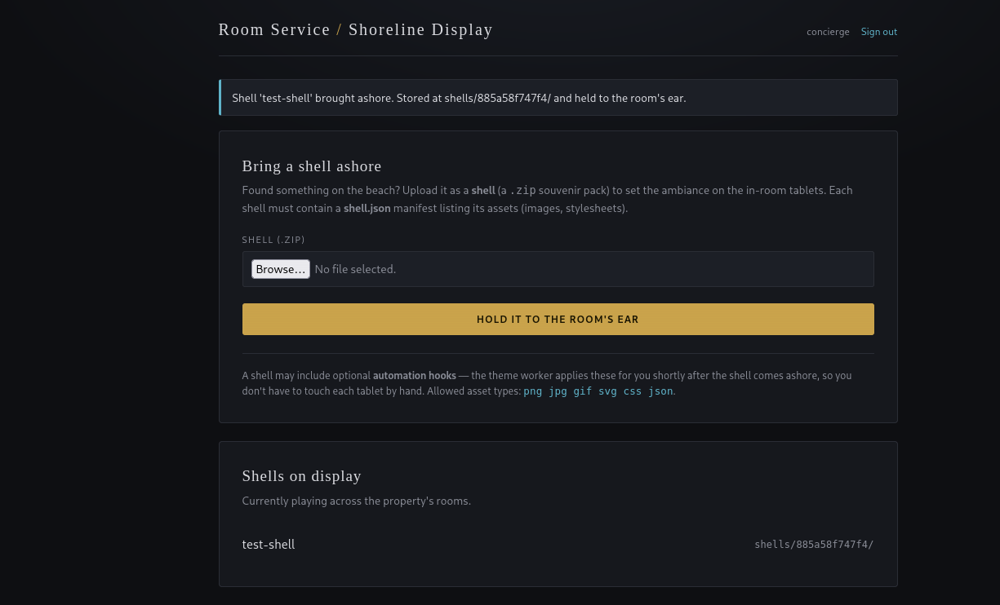

7. Browsed directly to `shells/<id>/shell.json` and, sure enough, the manifest came back as a plain, publicly accessible file. That confirmed anything landing in the `shells/` path is reachable straight over HTTP — no auth required.
   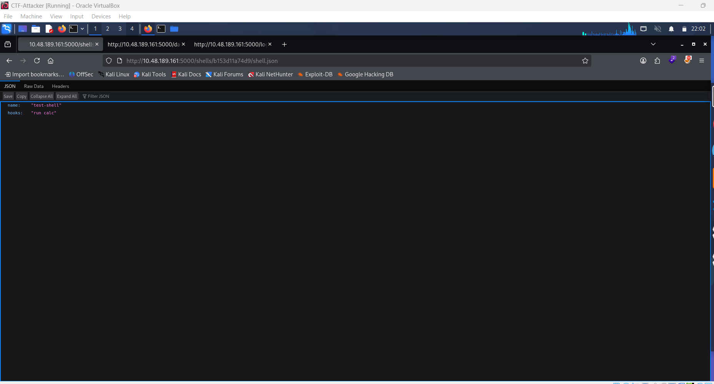

8. Went back to inspect element and noticed the page was importing `static/style.css` — except trying to hit `/static` directly in the browser didn't work. The page also kept hinting at something "slipped," which pointed toward a Zip Slip vulnerability: using a path like `../shell.json` inside the archive to make the extraction write files somewhere other than the intended folder. With that in mind, I noted down the directories worth targeting:

    ```text
    /shell
    /static
    /hooks -> not confirmed yet, but strongly suspected given the room's talk of "automation hooks"
    ```

9. Used Python to actually pull off the zip slip, since the standard `zip` CLI sanitizes `../` in filenames and won't let you traverse. Python's `zipfile` module has no such restriction — it writes whatever entry name you give it. This script builds a valid `shell.json` alongside a traversal payload aimed at the `/static` directory:

    ```python
    import zipfile
    with zipfile.ZipFile("shell.zip", "w") as z:
        z.writestr("shell.json", '{"name": "test-shell"}')
        z.writestr("../../static/proof.txt", "hello from zip slip")
    ```

   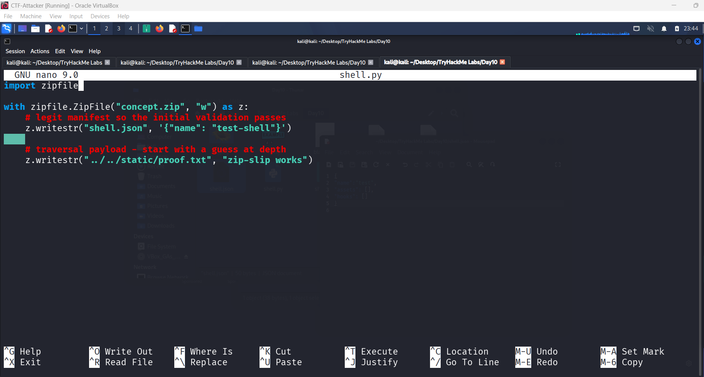

   The double `../` isn't arbitrary — it comes from comparing the two known URL structures:

    ```text
    http://<IP-ADDRESS>:5000/shells/<ID>/shell.json
    http://<IP-ADDRESS>:5000/static
    ```

   Every upload gets stored under `shells/<ID>/`, so climbing up two directory levels from there lands exactly on `static/` — which is why two `../` was the right depth.

10. Before uploading, checked the contents of the zip to make sure the traversal entry was actually in there as intended.
    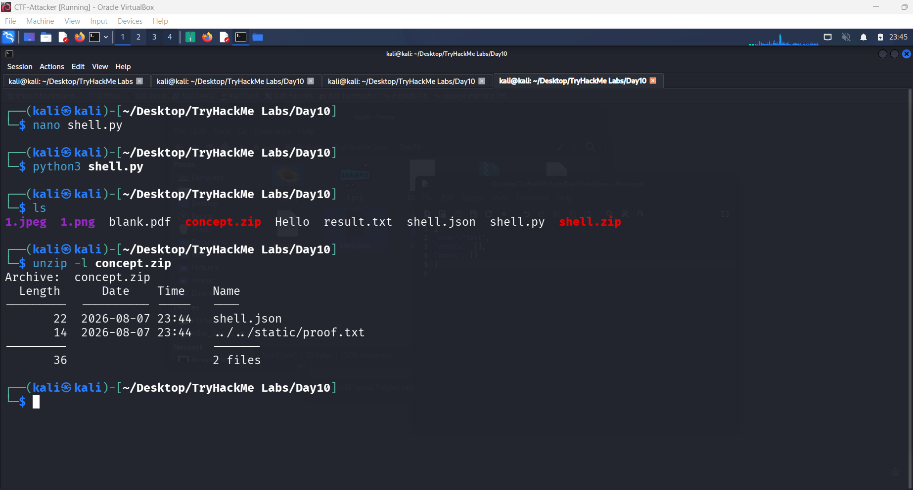
    Then uploaded it and checked `/static/proof.txt` directly — and it worked.
    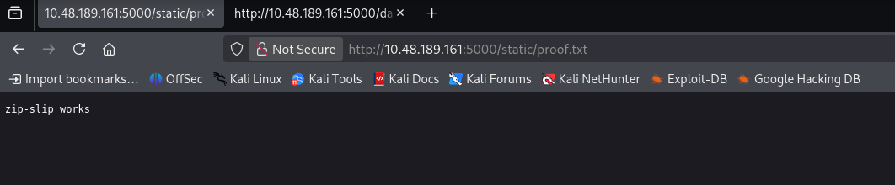
11. With traversal confirmed, the next question was: what if this could deliver a reverse shell instead of a harmless text file? Since the Nmap results showed Gunicorn, which usually means a Flask or Django app underneath, a Python reverse shell script was the natural fit. The `/hooks` directory still wasn't confirmed to exist, but given how much the site emphasized "automation hooks," it was worth aiming the payload there to see if anything picked it up.
    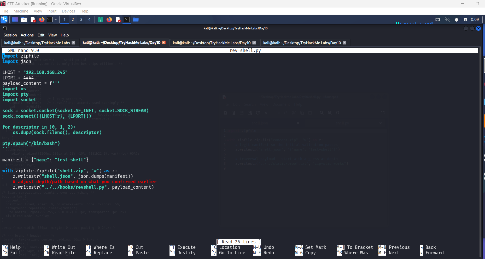
    Ran `unzip -l <zip-file>` one more time before uploading, just to double-check the archive structure was exactly what I expected.
    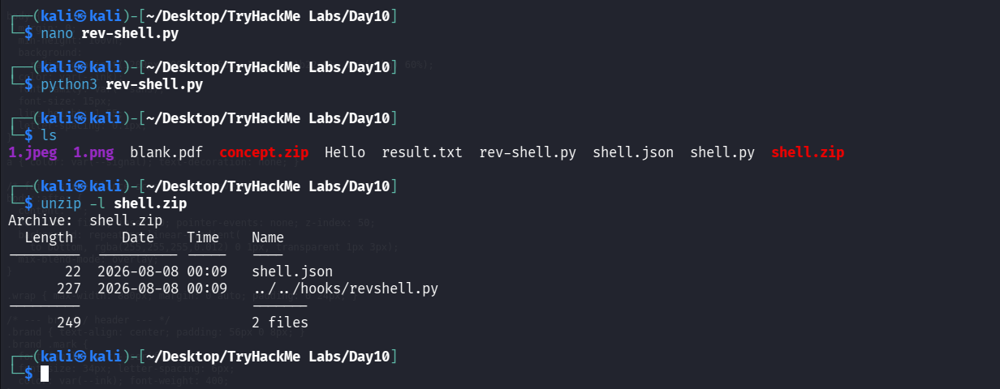

12. Set up a listener using Penelope from GitHub:

    ```bash
        wget -q https://raw.githubusercontent.com/brightio/penelope/refs/heads/main/penelope.py && python3 penelope.py
    ```

    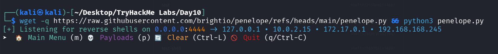

13. Uploaded the crafted shell through the dashboard and checked back on the listener — it had already caught a connection. That confirmed the `/hooks` directory was real and something was actively executing whatever landed in it. From there, ran `whoami` and `id` to see exactly who I was running as.
    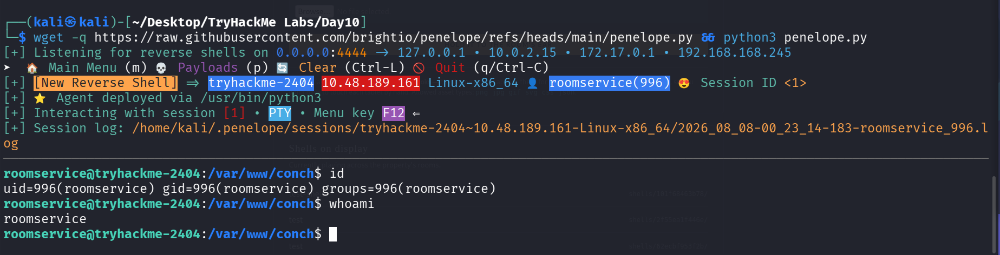
14. With the username confirmed, headed straight into the home directory and found `flag.txt` waiting there:

```bash
    cd /home/username
```

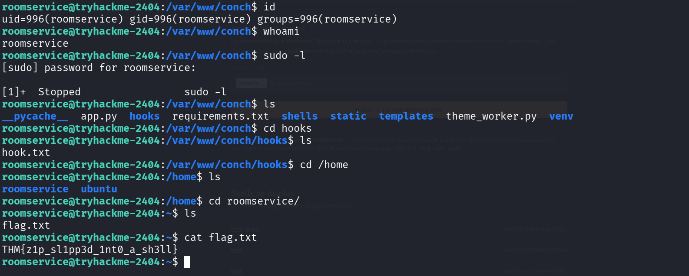

---

## What I Learned

This room was a good reminder that file upload features are rarely just about the file itself — the real risk usually lives in how the server unpacks, stores, and later processes what you hand it. The initial foothold came from something almost embarrassingly simple, a default credential left in an HTML comment, which set the tone for the rest of the challenge: convenience shortcuts left behind by developers tend to be exactly what an attacker needs. The more interesting part was reasoning through the upload flow with no documented schema to go on, since watching how the server's error messages changed in response to malformed input turned out to be the fastest way to reverse-engineer what it expected. The flavor text ended up being a genuine hint rather than just theming, and once I recognized the "slip something inside" language as pointing at Zip Slip, testing traversal against a known static directory before touching anything sensitive gave a safe way to confirm the vulnerability without guessing blindly. Chaining that arbitrary write into the `hooks/` directory, and having it silently picked up and executed by a background worker, made it clear how dangerous an unvalidated automation feature can be when it's paired with a file write primitive — neither piece is catastrophic alone, but together they add up to full remote code execution
