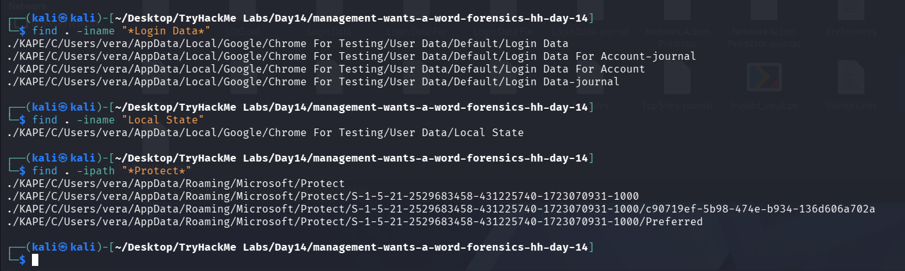
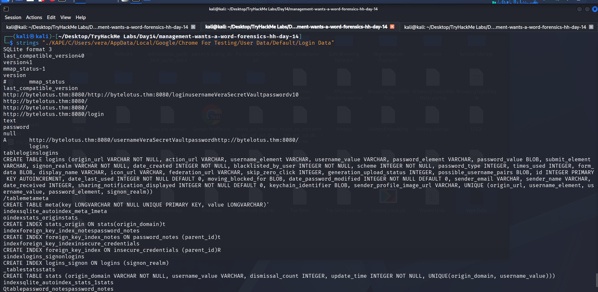
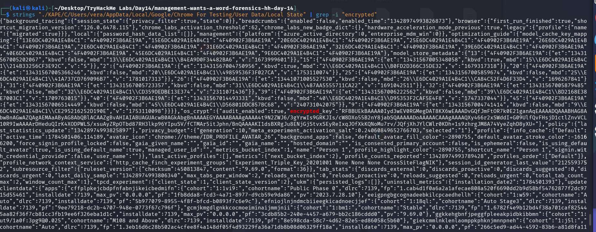
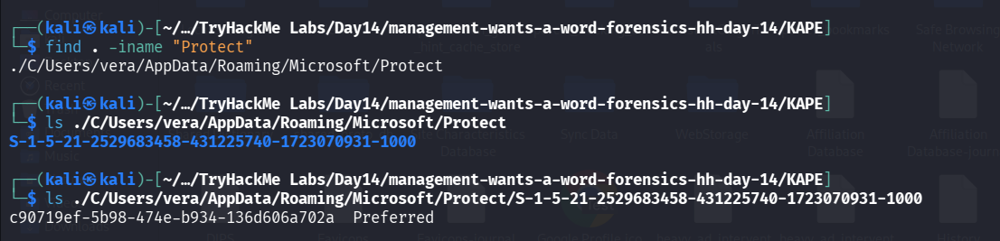
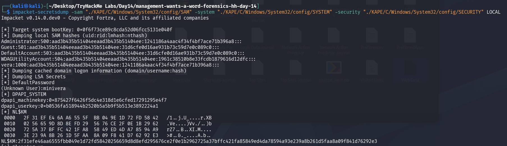
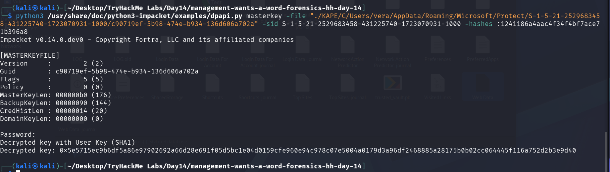
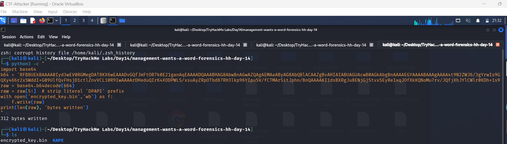
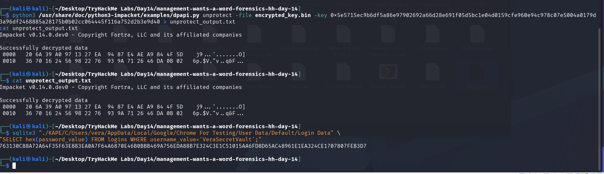
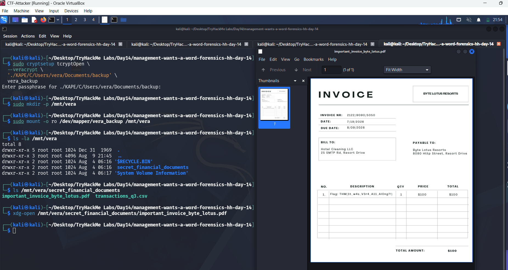

# Day 14 — Management Wants a Word

## Summary

Management Wants a Word
It was always her. It was never a bug; it was the business model.

## Objective

Housekeeping found a guest's laptop left behind after an early checkout, Room 214, registered to a "Vera." IT pulled a full triage before wiping it for the next guest.

Hunt down the artifacts scattered across her machine and figure out how they fit together. Somewhere in that trail is a password she never meant to leave behind. Follow it, and it'll open a door to something she was keeping very quiet.

The itinerary for the day was simple on paper: take a closer look at what she left behind, realize some things aren't as locked away as she thought, and finally find out what she was hiding to claim the flag. In practice that meant chasing a saved browser credential all the way down through DPAPI, cracking it open with a Windows password recovered from LSA secrets, and using what fell out to unlock a VeraCrypt container she never expected anyone to find.

## Tools / Techniques / Threat Vectors

- **KAPE** — the triage collection I was handed; gave me a clean `C:\Users\vera` and `C:\Windows\System32\config` layout to work from without needing to image a full disk.
- **strings / grep** — for pulling readable text out of SQLite database files and JSON blobs without needing to open them properly first.
- **sqlite3** — to query Chrome's `Login Data` database directly for the stored credential row.
- **impacket-secretsdump** — to dump local SAM account hashes and, critically, LSA secrets (which is where the plaintext `DefaultPassword` was hiding).
- **impacket's dpapi.py** — used in two different modes: `masterkey` (to decrypt a DPAPI master key file using a recovered NTLM hash or password) and `unprotect` (to decrypt an arbitrary DPAPI blob using that recovered master key).
- **jq + base64** — to cleanly extract and decode the `os_crypt.encrypted_key` field out of Chrome's `Local State` JSON.
- **pycryptodome (AES-GCM)** — to manually decrypt Chrome's `v10`-format password blob once I had the raw AES key.
- **cryptsetup (tcryptOpen --veracrypt)** — the Linux-native way to mount a VeraCrypt container without needing the VeraCrypt binary itself.
- **Threat vector in play**: DPAPI credential chaining. Windows protects browser-saved passwords behind a chain of DPAPI master keys that are themselves protected by the user's logon secret. If an attacker (or, in this case, an investigator) can recover that logon secret from any source — a password, an NTLM hash, or an LSA secret — the entire chain unravels, and everything the browser ever remembered becomes readable offline.

## Steps Taken

### 1. Getting oriented in the triage

The KAPE output gave me a `C` drive with the usual suspects: `Users\vera`, `Users\Default`, and `Windows\System32\config`. Vera's profile had both an `AppData` folder and a `Documents` folder sitting next to her `NTUSER.DAT` hive, so I had registry data, application data, and personal files all in play from the start. The `config` folder under `System32` meant the SAM, SYSTEM, and SECURITY hives were also on the table — that would matter a lot later.


### 2. Hunting for saved browser credentials

The flavor text was blunt about it — "a browser will remember things for you that you never told anyone else" — so I went straight for Chrome's credential store. A recursive `find` for anything matching `*Login Data*` turned up the profile database sitting under `AppData\Local\Google\Chrome For Testing\User Data\Default`, along with its `-journal` files and a separate `Login Data For Account` variant (Chrome's newer account-scoped store, which turned out to be empty).

Running `strings` against `Login Data` surfaced a login entry in plaintext structure: an origin of `http://bytelotus.thm:8080/`, a username of `VeraSecretVault`, and a password field tagged with the `v10` prefix — Chrome's marker for an AES-256-GCM encrypted secret rather than legacy DPAPI-only encryption. That confirmed the target and confirmed I'd need the browser's decryption key before the password meant anything.


### 3. Locating the encryption key material

Chrome's AES key for `v10` blobs isn't stored on disk in the clear — it's wrapped in DPAPI and kept in the `Local State` file next to the profile. Running `strings ... | grep -i "encrypted"` on `Local State` located the `os_crypt.encrypted_key` field, a base64 blob beginning with `RFBBUEk...` — which decodes to the literal ASCII string `DPAPI`, confirming this key itself needed to go through Windows' Data Protection API before I could use it.


DPAPI master keys live under `AppData\Roaming\Microsoft\Protect\<SID>`, so I searched for that path and found Vera's SID folder: `S-1-5-21-2529683458-431225740-1723070931-1000`. Inside sat a single GUID-named master key file, `c90719ef-5b98-474e-b934-136d606a702a`, plus a `Preferred` file marking it as the active key.


### 4. Recovering Vera's Windows credentials from the SAM/SYSTEM/SECURITY hives

To decrypt a DPAPI master key for a local (non-domain) account, you need either the account's plaintext password or its NTLM hash. Both were sitting in the config hives I already had.

First pass with `impacket-secretsdump` against just SAM and SYSTEM gave me every local account's NTLM hash — Vera's came back as `1241186a4aac4f34f4bf7ace71b396a8`. Interestingly, that hash was identical to the local Administrator account's hash, which is its own small tell about password reuse on this machine.

The hash alone should have been enough to unlock the master key, but the specific build of `dpapi.py` I had (`0.14.0.dev0`) kept prompting for a password and refusing to proceed on `-hashes` alone. Re-running `secretsdump` with the `SECURITY` hive included this time surfaced something better: an LSA secret named `DefaultPassword` with the value `minivera` — a plaintext Windows autologon password, extracted straight from the SECURITY hive rather than cracked.


### 5. Decrypting the DPAPI master key

Feeding `minivera` into `dpapi.py masterkey` along with the master key file and Vera's SID worked cleanly:

```python
python3 dpapi.py masterkey -file <path_to_GUID_file> -sid S-1-5-21-2529683458-431225740-1723070931-1000 -password minivera
```

This returned a decrypted master key: `0x5e5715ec9b6df5a86e97902692a66d28e691f05d5bc1e04d0159cfe960e94c978c07e5004a0179d3a96df2468885a28175b0b02cc064445f116a752d2b3e9d40`. That's the actual symmetric key protecting everything DPAPI-wrapped for this user account — including Chrome's `os_crypt` key.


### 6. Unwrapping Chrome's AES key

With the master key in hand, the next step was extracting the raw bytes of `os_crypt.encrypted_key` from `Local State`, stripping the literal `DPAPI` prefix (5 bytes), and running the result through `dpapi.py unprotect` (the renamed equivalent of the older `blob` subcommand) using the master key as the decryption key:

```p
python3 -c "
import base64
b64 = 'RFBBUEkBAAAA0Iyd3wEV0RGMegDAT8KX6wEAAADvGQfJmFtOR7k0E21ganAqEAAAADQAAABHAG8AbwBnAGwAZQAgAEMAaAByAG8AbQBlACAAZgBvAHIAIABUAGUAcwB0AGkAbgBnAAAAEGYAAAABAAAgAAAA4t9N2ZWJ6/3gYrwIs9GRKJIs/cW8DXo55B2nY8jabSQAAAAADoAAAAACAAAgAAAAQXy466r2xSWddI+G09UlfQvFHsjD1ctlZnvVCL10R9IwAAAArDHeduQIrK4XODPWLS/xsuAyZRpOTbd87RH3lkp96YIpuSV/fCTMAr5itJphn/BnQAAAAKI1dsBXRgJu8ENjGjStvxSEyReIxqJOfXkKQNoMu7rv/JQfjXhJYlCWlr0KDh+1s9zhrgJM8A74VyeZqhD8yXU='
raw = base64.b64decode(b64)
raw = raw[5:]  # strip literal 'DPAPI' prefix
with open('encrypted_key.bin','wb') as f:
    f.write(raw)
print(len(raw), 'bytes written')
"
```



That produced a clean 32-byte AES-256 key: `20 6a 39 a0 97 13 27 ea 94 87 e4 ae a9 84 4f 5d 36 70 16 24 56 98 22 76 93 9a 71 26 46 da 0b 02`. I double-checked the byte count programmatically rather than trusting an eyeballed transcription off a hex dump — a hand-copy slip earlier had already cost me one wrong digit, which is exactly the kind of mistake that silently breaks an AES-GCM auth tag check further down the line.



### 7. Decrypting the stored password

With the real AES key confirmed, I pulled the encrypted password blob for the `VeraSecretVault` login directly out of the SQLite database:

```bash
sqlite3 "Login Data" "SELECT hex(password_value) FROM logins WHERE username_value='VeraSecretVault';"
```


Chrome's `v10` format breaks down as: 3 bytes for the `"v10"` tag, 12 bytes of AES-GCM nonce, then ciphertext, with the final 16 bytes being the GCM authentication tag. Splitting the blob out and running it through `AES.MODE_GCM` with the recovered key decrypted cleanly and passed the auth tag check on the first try:

**Password: `Wh4t1sV3raD0inG0nTh1sH0st`**

Given the username was literally `VeraSecretVault`, this didn't read like a normal login password — it read like something meant to open a container, not a webpage.

### 8. Finding and mounting the hidden VeraCrypt volume

A search through `vera\Documents` turned up a file simply named `backup` — no extension, no obvious header, sized like a container rather than a document. Since VeraCrypt volumes are deliberately headerless (they're designed to look like random noise so they don't announce themselves), that fit.

Rather than installing the full VeraCrypt binary, I mounted it using cryptsetup's built-in TrueCrypt/VeraCrypt-compatible mode:

```bash
sudo cryptsetup tcryptOpen --veracrypt './KAPE/C/Users/vera/Documents/backup' vera_backup
sudo mkdir -p /mnt/vera
sudo mount -o ro /dev/mapper/vera_backup /mnt/vera
```

At the passphrase prompt, I entered the password recovered from Chrome: `Wh4t1sV3raD0inG0nTh1sH0st`. It mounted without complaint.



### 9. Claiming the flag

Inside the mounted volume sat a `secret_financial_documents` folder containing `transactions_q3.csv` and `important_invoice_byte_lotus.pdf`. Opening the PDF, it looked exactly like a legitimate invoice from "Byte Lotus Resorts" — until line item 1 on the itemized table:

```
Flag: THM{1t_w4s_V3ra_A11_A1Ong?!}
```

Hidden as an innocuous line-item description on a fake billing document, right in plain sight of anyone who wasn't looking closely.


## What I Learned

This one was a genuinely satisfying full-chain exercise in why DPAPI-protected credentials are only as strong as whatever secret ultimately unlocks them — I went from spotting a browser-saved login, to recognizing its `v10` encryption meant a DPAPI master key had to come first, to pulling that key's GUID out of the `Protect` folder, to recovering Vera's actual Windows secret not through cracking but by adding the SECURITY hive to my `secretsdump` run and finding a plaintext LSA `DefaultPassword`, and finally using that single password to cascade through the master key, the Chrome AES key, and the stored password itself. The password reuse (Vera and Administrator sharing an NTLM hash) and the "VeraSecretVault" username were both quiet hints that the recovered secret wasn't meant for a login page at all — it was meant for a VeraCrypt container hiding financial records under an innocent-looking invoice. It reinforced two habits I want to keep: don't stop at the first plausible-looking secret without asking what it's actually *for*, and never eyeball-transcribe hex or key material off a screenshot — verify byte counts and values programmatically, because a single mis-copied nibble silently breaks everything downstream in an authenticated cipher.