# Day 8 — Towel on the Sunbed

## Summary

Ponzi set his towel down for one 24-hour reward claim. He came back to find the sunbed had been "claimed" three times over while he wasn't looking.

## Objective

The resort's wellness portal is quietly running a side project: **Ponzi**, a poolside crypto rewards app. Guests can claim a small reward once every 24 hours, and enough accumulated rewards unlock access to a "Whale Vault."

Ponzi set his towel down, claimed his daily reward, and stepped away to reapply sunscreen. When he came back, his sunbed — and his reward balance — had somehow been "claimed" three times over. He's convinced this entitles him to a spot in the Whale Vault; the app disagrees, politely, once every 24 hours.

The goal of this challenge is to find the gap between what the server *thinks* happened and what actually happened — and use it to reach whale-tier balance and unlock the vault before the 24-hour cooldown would normally allow.

## Tools / Techniques / Threat Vectors

- **Burp Suite** (Proxy, Repeater, and Response/Request Interception) — used to intercept, inspect, and replay HTTP requests.
- **Browser DevTools** — used to review client-side JavaScript (`auth.js`, dashboard scripts) and API calls.
- **Client-side logic review** — confirming that reward-eligibility checks (cooldown timer, claim button state) were enforced only in the browser, not the server.
- **Response tampering** — intercepting and editing a JavaScript response to test whether disabling the client-side cooldown alone was enough to bypass the restriction.
- **Race Condition (TOCTOU) exploitation** — using Burp Repeater's *last-byte sync* feature to send multiple `claim` requests in parallel, exploiting the time gap between the server checking claim eligibility and updating claim state.
- **Threat vector**: insecure server-side state validation on a financial/reward-bearing endpoint, allowing concurrent requests to each pass an eligibility check before any of them commit their state update.

---

## Steps Taken

### 1. Reconnaissance and account creation

Using browser DevTools, I inspected the login page and found it was backed by `auth.js`. Reviewing the script confirmed there was no meaningful client-side filtering or validation — all real checks would need to happen server-side.

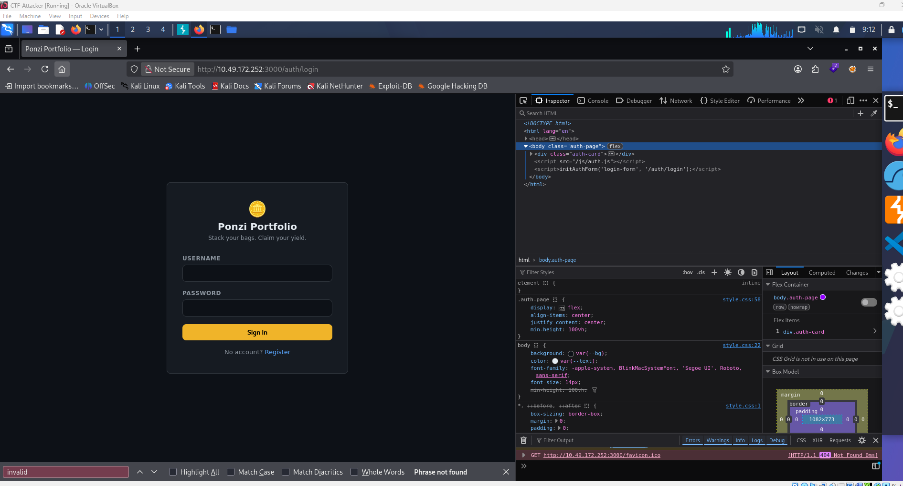

The challenge asked me to create a guest account rather than break into an existing one. Attempting to register with a "guest"-style username returned an "already taken" error, confirming the app was actively tracking existing accounts. I registered a fresh account instead.

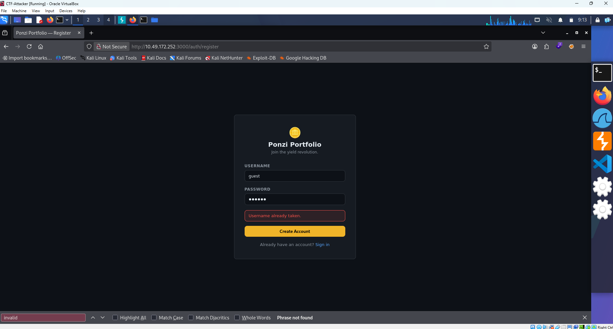

### 2. Exploring the dashboard and reward mechanism

After logging in, I claimed a reward normally to reproduce Ponzi's exact steps, per the room's prompt: *"Create a guest account and explore Ponzi's daily reward mechanism."*

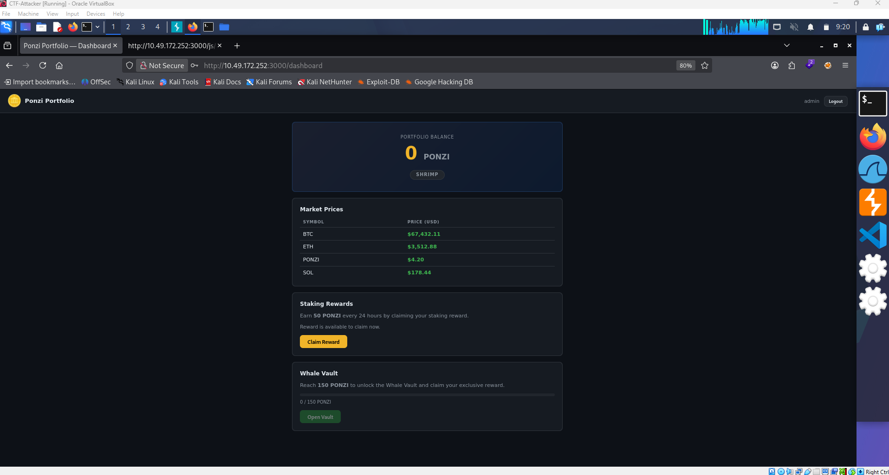
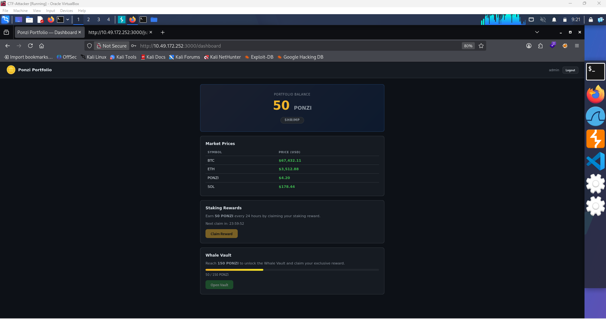

Inspecting the dashboard's JavaScript revealed four main blocks of logic:

1. Loads dashboard/profile data from `/dashboard/api/me`
2. Handles the **Claim Reward** button
3. Handles the **Open Vault** button (this block contains the flag variable, but it's only populated once the vault is actually reachable)
4. Handles logout
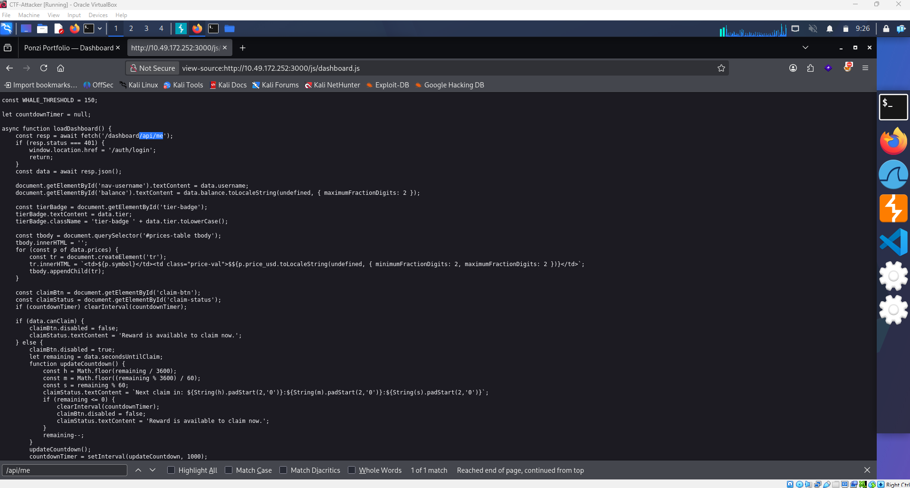

> **Note:** The flag variable is visible inside the "Open Vault" logic, but it only resolves to a real value once the vault has actually been unlocked — so the goal became clear: reach whale-tier balance to open the vault.

### 3. Inspecting the API and testing response tampering

Digging into `/dashboard/api/me` showed the data driving the UI: current balance, the whale-tier threshold, seconds remaining until the next claim, and current claim status. At 50 units per claim on a 24-hour cooldown, reaching whale tier legitimately would take roughly two days.

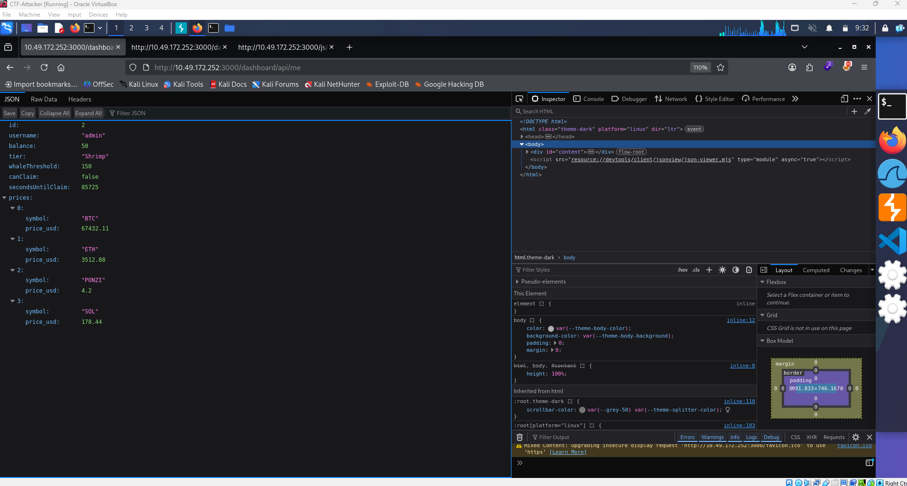

As a first test, I intercepted the response containing this JavaScript (via Burp's "Do intercept" → "Response" toggle) and manually edited the countdown to `0` and re-enabled the claim button client-side, then forwarded it.

**Before:**
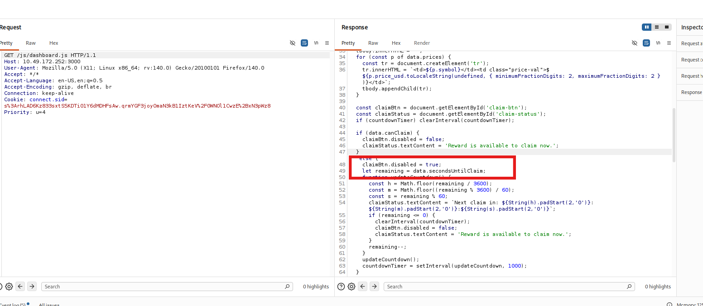
**After:**
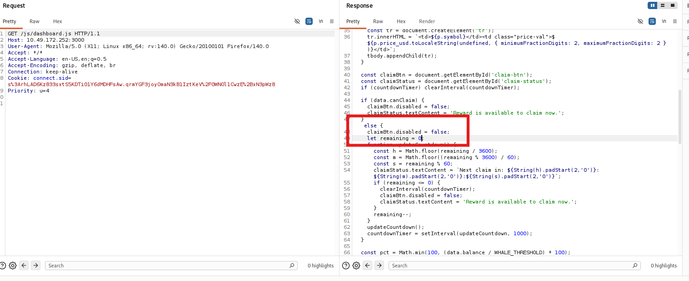

This did not work — clicking Claim Reward again returned `Reward already claimed`, confirming the server was independently tracking claim eligibility and wasn't relying on the client-side countdown at all.

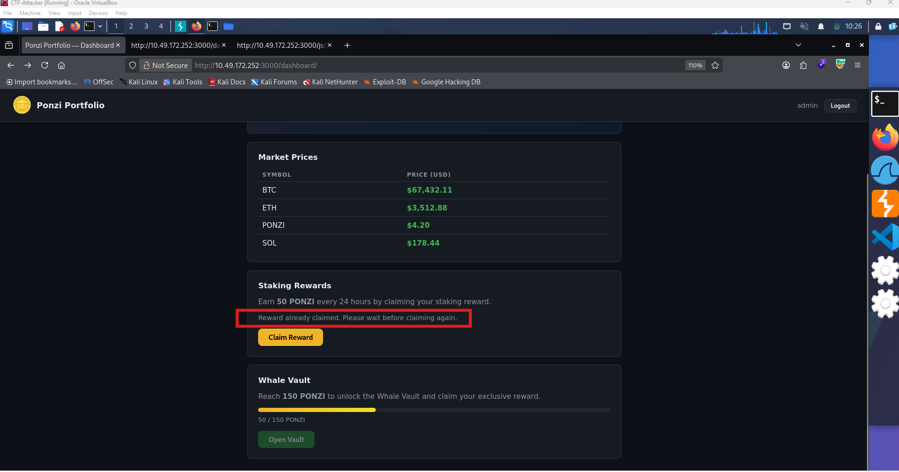

### 4. Exploiting a race condition with Burp Repeater's last-byte sync

Since client-side manipulation was a dead end, the next hypothesis was a **race condition**: if the claim endpoint checks eligibility and then updates state as two separate steps, sending many claim requests at virtually the same instant might let several of them pass the eligibility check before any of them actually writes the "already claimed" state.

I created a new account to start with a clean slate.

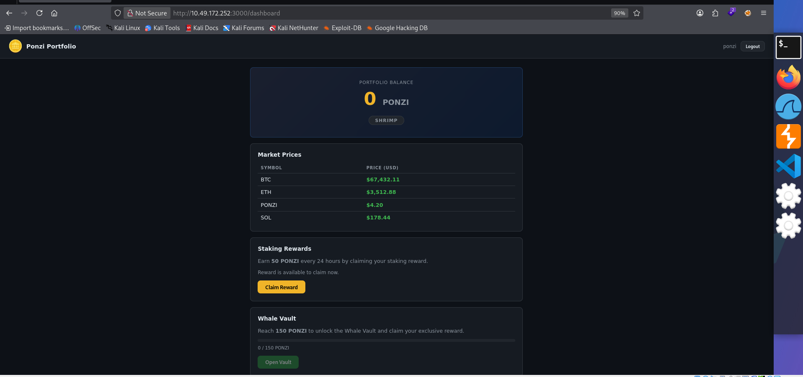

With intercept enabled *before* clicking Claim (important — otherwise the request won't be caught), I sent the intercepted claim request to Repeater.

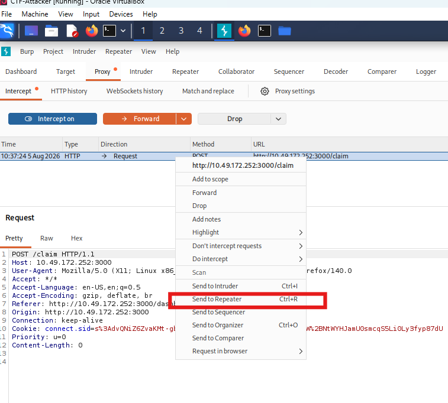

In the Repeater tab, I grouped multiple copies of this request together: right-click the tab → **Add tab to group** → **New tab group** → name it.

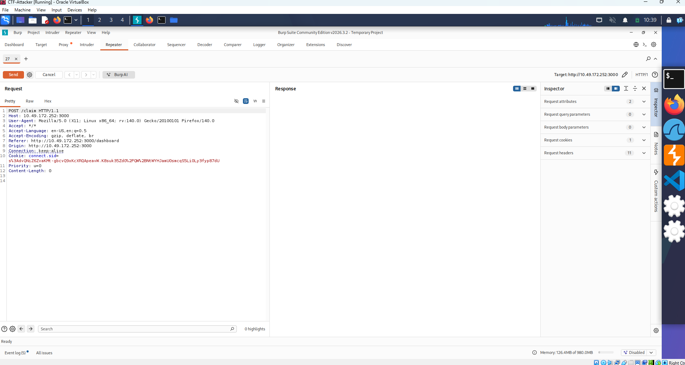
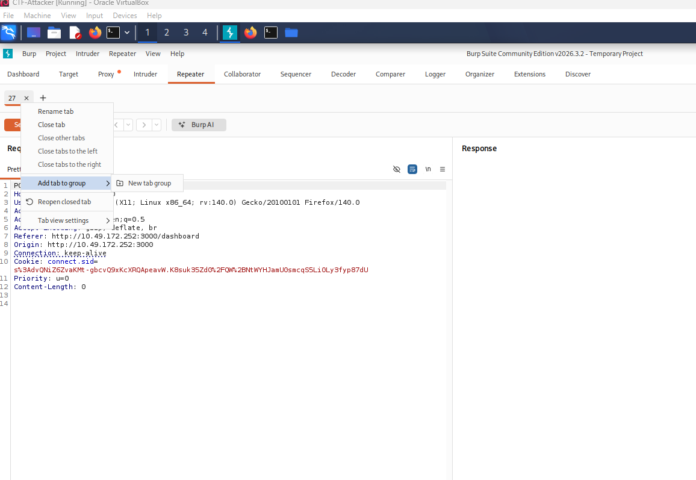

I then duplicated the tab as many times as needed within that group.

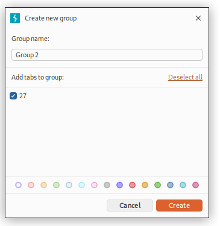
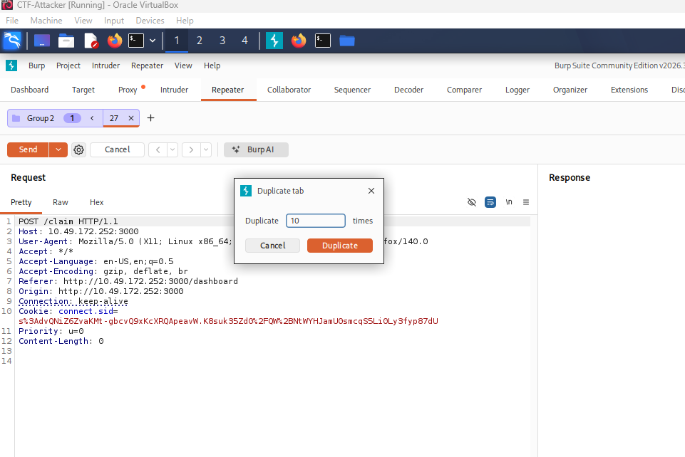

Finally, using the dropdown next to the **Send** button, I selected **Send group in parallel (last-byte sync)**. This holds each request open until the very last byte, then releases them all simultaneously — maximizing the chance the server processes several claims concurrently rather than sequentially.

After sending, the response showed a balance of 550 — enough to cross into whale tier.

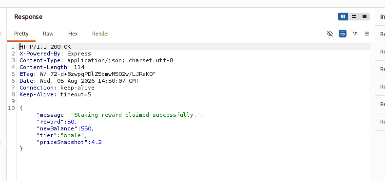

With whale-tier balance reached, the vault was now accessible, and opening it revealed the flag.

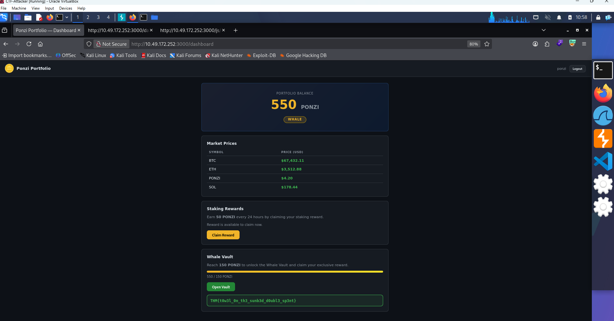

---

## What I Learned

This room reinforced that client-side restrictions like countdown timers and disabled buttons are cosmetic, not real security controls — the server enforced the cooldown independently, so tampering with the response alone was never going to work. The actual vulnerability was a race condition (TOCTOU bug) in how the server handled the claim endpoint: it likely checked eligibility and updated the balance as two separate steps without any atomicity or locking, so firing several requests at once using Burp Repeater's last-byte sync let multiple claims slip through the eligibility check before any of them finished writing state. It was a good reminder that some of the most impactful bugs aren't visible in the code you can read top-to-bottom — they only show up under concurrent load — and that fixes for this class of issue generally come down to atomic database operations, row-level locking, or idempotency keys rather than trusting a single sequential check.