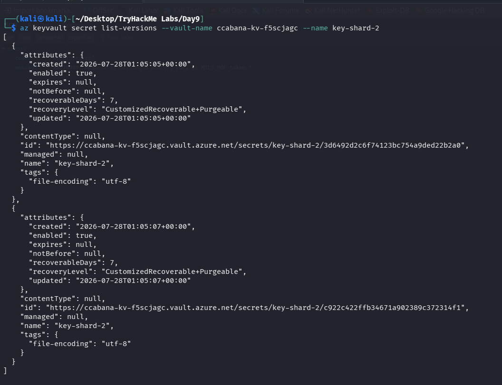
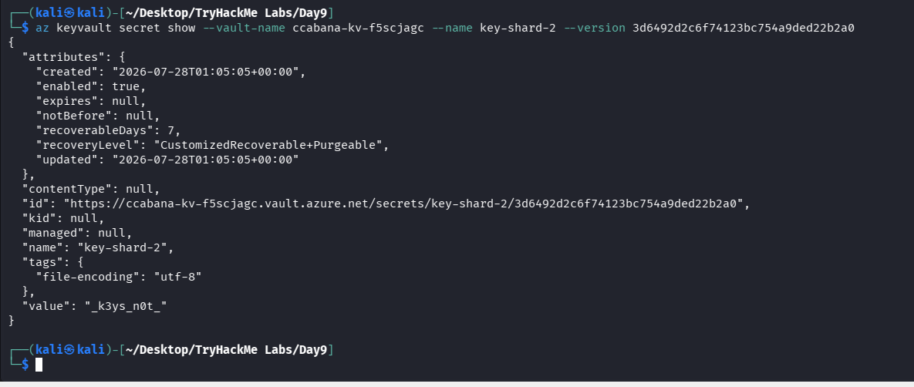

# Day 9 — CryptoCabana

## Summary

He never signed the transfer. The place he stashed his secret wasn't as sealed as promised.

## Objective

Find out what the kiosk is quietly trusting to reach into storage on its own, and see how much further that trust actually extends.

## Tools / Techniques / Threat Vectors

- **Azure CLI (`az`)** — used to authenticate with a SAS token and later a service principal, then enumerate and read from Blob Storage and Key Vault.
- **Browser DevTools / View Source** — used to inspect the static site's client-side JavaScript for hardcoded secrets.
- **Azure Blob Storage static website hosting** (`*.web.core.windows.net`) — the front end had no backend of its own, so all "backup" logic ran client-side.
- **Overscoped SAS token** (`srt=sco`) — a shared access signature meant for one container was valid at the storage account's service level, allowing full container enumeration.
- **Hardcoded credentials in a public container** — a service principal's `client_id` / `client_secret` / `tenant_id` sitting in plaintext inside a blob.
- **Azure Key Vault secret versioning** — a "rotated" secret's prior version remained retrievable, defeating the rotation.
- **Azure RBAC (Role-Based Access Control)** — one secret (`master-key`) correctly denied access, showing the difference between a secret merely existing and a caller actually being authorized to read it.

---

## Steps Taken

1. **Recon on the static site.** Opened `cryptocabanaf5scjagc.z13.web.core.windows.net` and noted the domain pattern — `*.web.core.windows.net` — which identifies an Azure Storage static website rather than a traditional app server. This meant any "backup" functionality had to be implemented entirely in client-side JavaScript.

2. **Read the client-side source.** Viewed page source and found `app.js`, which contained hardcoded values:
   - `STORAGE_ACCOUNT = "cryptocabanaf5scjagc"`
   - `BACKUPS_CONTAINER = "backups"`
   - A SAS token (`BACKUP_SAS`) used to authorize a browser-side `PUT` request straight to Blob Storage whenever a user clicked "Back it up."

3. **Inspected the SAS token's scope.** Decoded the SAS query parameters and noticed `ss=b` (blob service) and `srt=sco` — signed resource types of **s**ervice, **c**ontainer, and **o**bject. This is broader than what a single-container "backup" feature should need; a properly scoped token would typically be limited to `srt=o` (object only) within one container.

4. **Enumerated containers at the service level.** Used the SAS token with:
   ```
   az storage container list --account-name cryptocabanaf5scjagc --sas-token "<SAS>"
   ```
   This returned three containers: `$web` (the site itself), `backups` (the intended target), and `vault` — a container never linked or referenced anywhere on the public page.

5. **Listed and downloaded blobs inside `vault`.** Found two files:
   - `seed_phrase.txt` — a decoy phrase sitting in plain sight.
   - `backup-service-account.json` — a service principal credential set (`client_id`, `client_secret`, `tenant_id`) for an "automation account," complete with an internal note warning it should be rotated if it ever left the vault — which it already had.

6. **Authenticated as the service principal.**
   ```
   az login --service-principal -u <client_id> -p <client_secret> --tenant <tenant_id>
   ```
   The JSON credential file also revealed the name and URI of an actual Azure Key Vault (`ccabana-kv-f5scjagc`), which is a separate service from Blob Storage with its own access control.

7.**Listed secrets in the Key Vault.**
   ```
   az keyvault secret list --vault-name ccabana-kv-f5scjagc
   ```
   Found four secrets: `key-shard-1`, `key-shard-2`, `key-shard-3`, and `master-key`.

8.**Read each secret's current value.**
   - `key-shard-1` → `THM{n0t_ur`
   - `key-shard-3` → `ur_c01ns!}`
   - `key-shard-2` → not a shard at all, just a note explaining it had been "rotated" but that the old value was still recoverable.
   - `master-key` → access denied with a clean `ForbiddenByRbac` error, confirming this identity genuinely had no role assignment for that secret (a dead end, not a puzzle to solve).

9.**Pulled the version history of `key-shard-2`.**

```text
   az keyvault secret list-versions --vault-name ccabana-kv-f5scjagc --name key-shard-2
```

   Two versions existed, created two seconds apart. The earlier version — predating the "rotation" — was the real shard.



10.**Retrieved the earlier version's value.**

``` text
    az keyvault secret show --vault-name ccabana-kv-f5scjagc --name key-shard-2 --version <old-version-id>
```



11.**Assembled the flag** by concatenating the three shards in order


---

## What I Learned

This challenge was really a chain of small, individually reasonable-looking decisions that added up to a full compromise. The root cause traces back to putting write-access credentials directly into client-side JavaScript, which is unavoidable for a purely static site with no backend, but becomes dangerous the moment that credential is scoped more broadly than the one action it's meant to support. A SAS token that should have been limited to writing objects into a single container was instead valid across the whole storage account, and that gap in scoping was the entire reason the rest of the attack was possible — nothing here required guessing or brute forcing, only reading what the account was willing to hand over. From there, the pattern repeated itself: a container nobody linked to held credentials that were more powerful than the token that found them, and those credentials led to a proper secrets manager that, on paper, should have been the secure endpoint of the whole system. Even Key Vault's access control worked correctly in one instance, denying `master-key` cleanly through RBAC, which was a useful reminder that authorization failures and missing secrets look different and should be read carefully rather than treated as the same kind of dead end. But the real lesson sits in the versioning behavior: rotating a secret is only meaningful as a mitigation if the old version is also revoked or made unreachable, because Key Vault keeps history by design, and a caller with read access to a secret can typically read its past values too, not just its current one. Put together, this is a good demonstration of why the principle of least privilege matters at every layer, not just at the outermost one, and why "sleep easy" promises on marketing copy are worth being skeptical of.